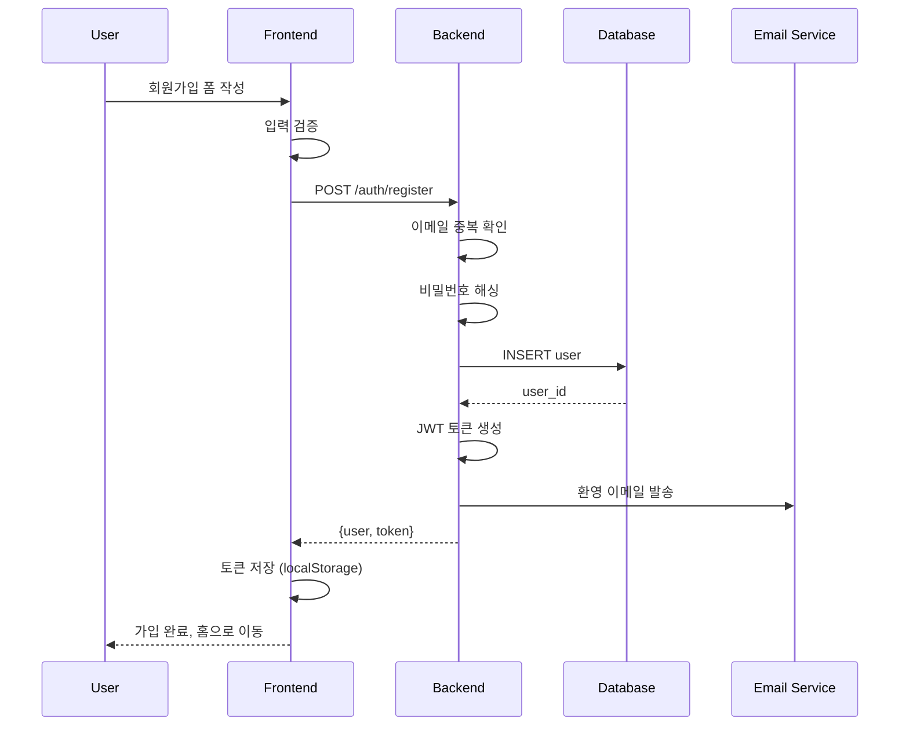
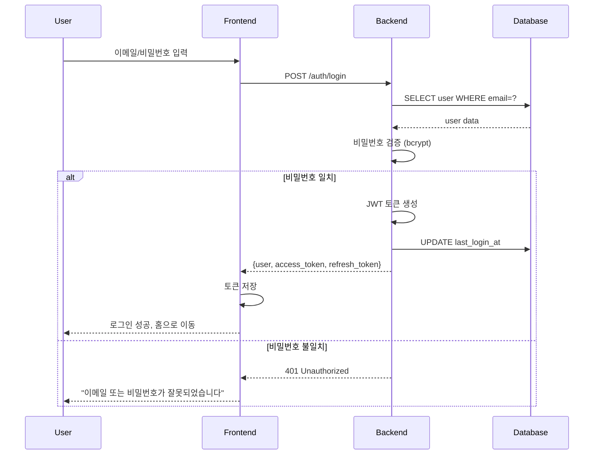
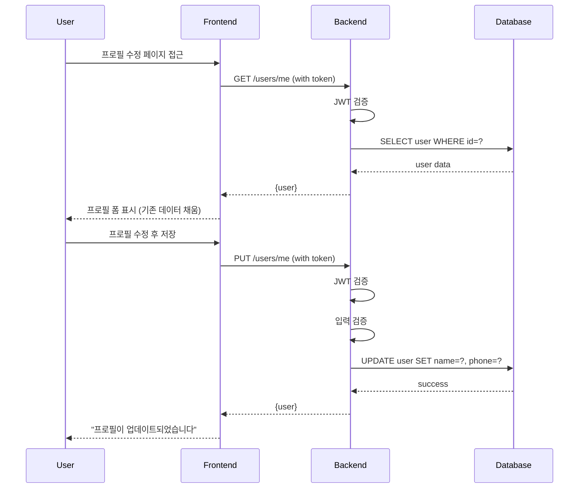
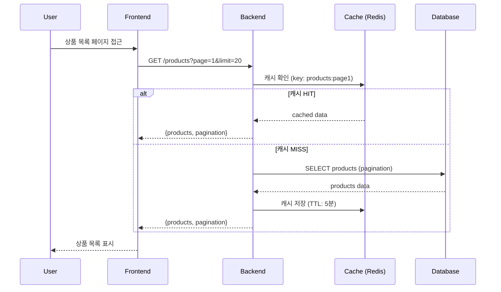
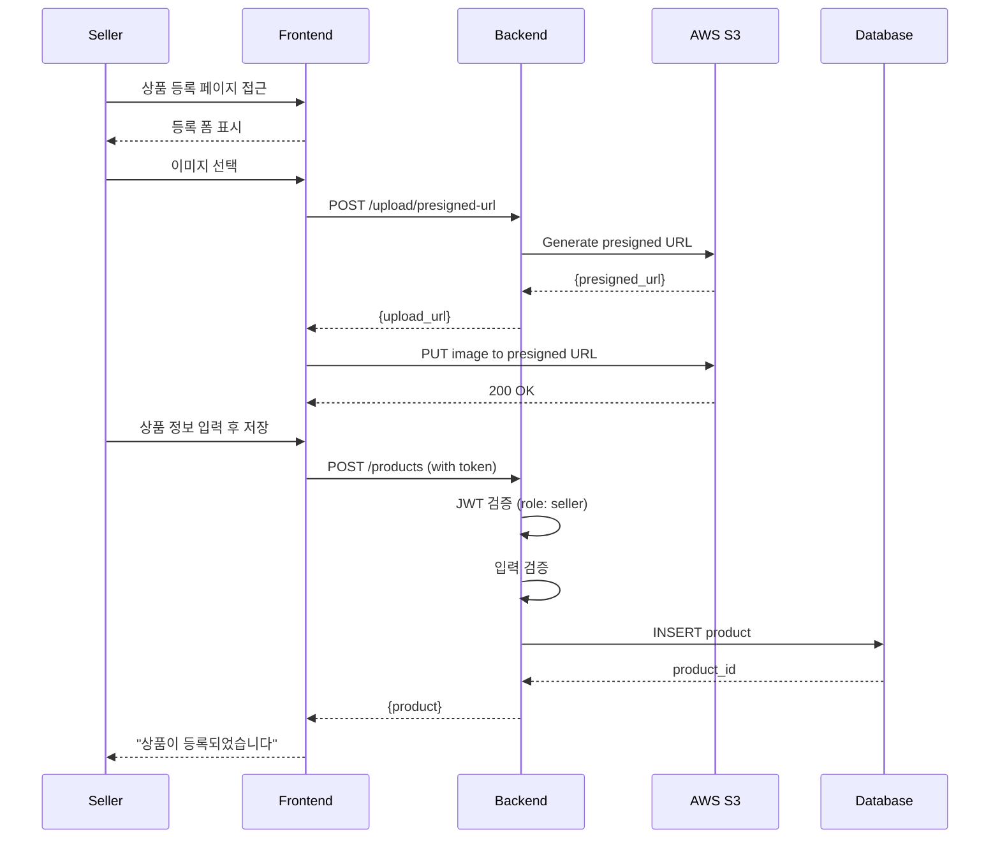
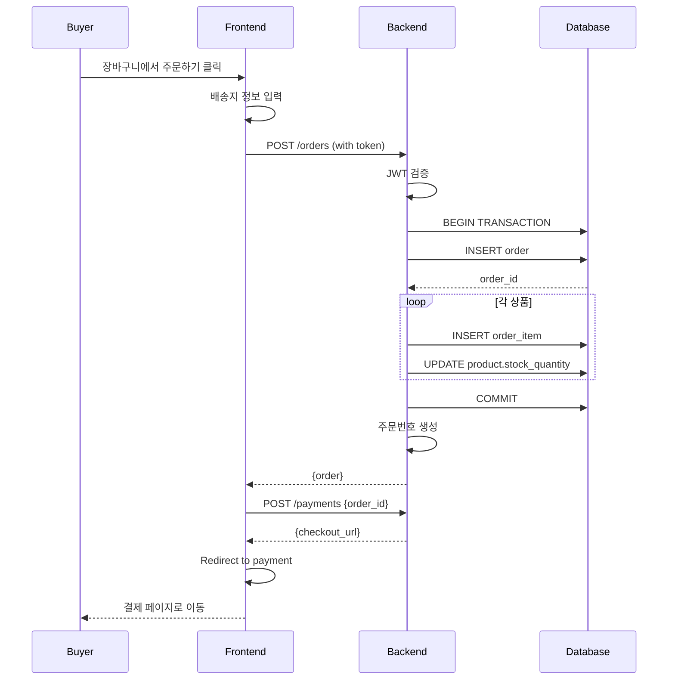
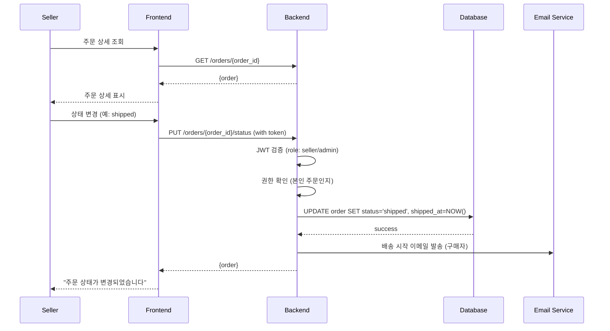
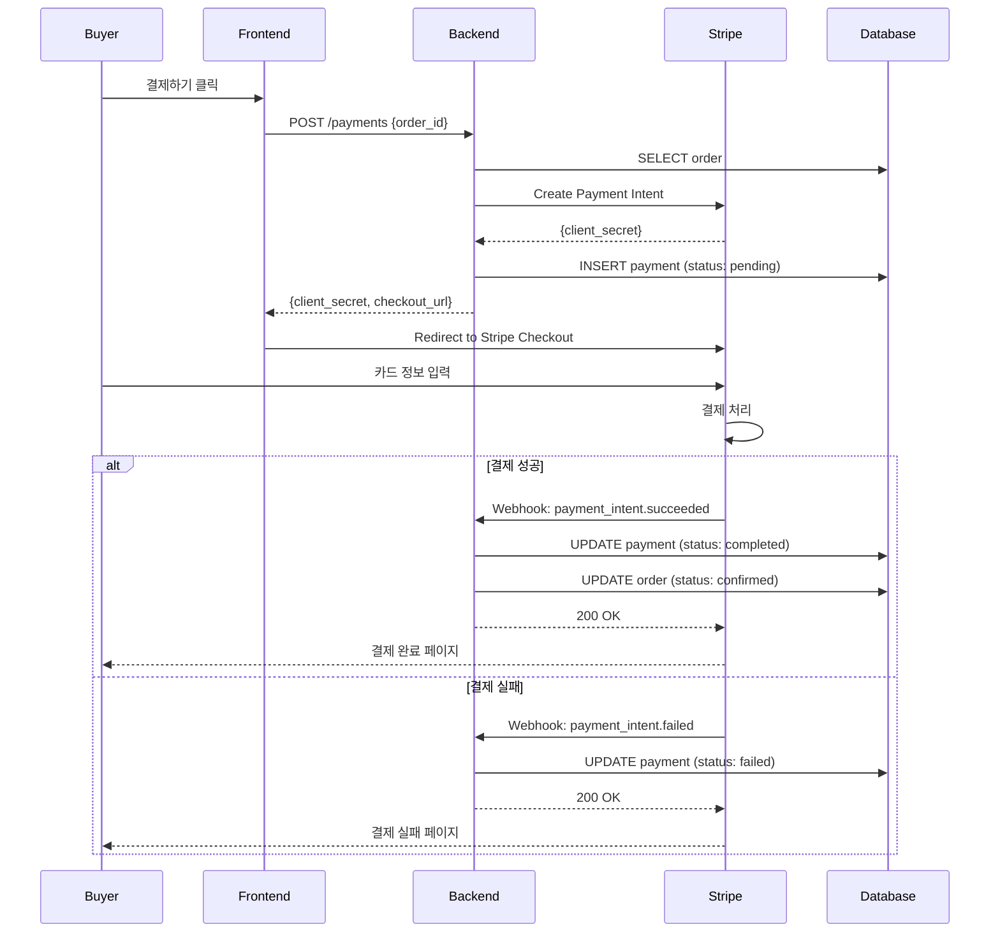
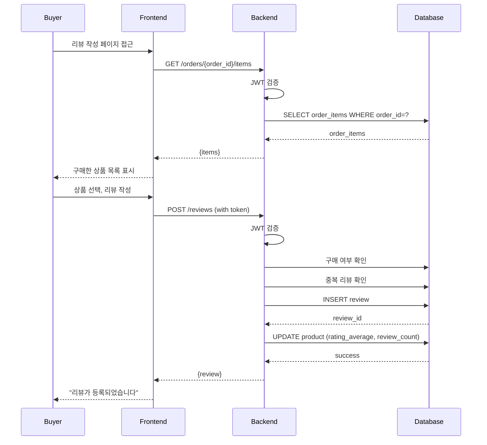

# 기능 정의서 (Phase 1 MVP)

## 문서 정보
- 작성일: 2025-11-19
- 버전: 1.0 (Phase 1 MVP)
- 목적: 시스템 기능 명세 및 흐름 정의

---

## 1. 기능 개요

### 1.1 시스템 기능 구조

```
SpicyJump Platform
├── 1. 사용자 관리
│   ├── 1.1 회원가입
│   ├── 1.2 로그인/로그아웃
│   ├── 1.3 프로필 관리
│   └── 1.4 비밀번호 관리
├── 2. 상품 관리
│   ├── 2.1 상품 조회
│   ├── 2.2 상품 등록 (판매자)
│   ├── 2.3 상품 수정/삭제 (판매자)
│   └── 2.4 재고 관리 (판매자)
├── 3. 주문 관리
│   ├── 3.1 장바구니
│   ├── 3.2 주문 생성
│   ├── 3.3 주문 조회
│   └── 3.4 주문 상태 변경
├── 4. 결제 관리
│   ├── 4.1 결제 처리
│   ├── 4.2 결제 내역 조회
│   └── 4.3 환불 처리
├── 5. 리뷰 관리
│   ├── 5.1 리뷰 작성
│   ├── 5.2 리뷰 조회
│   └── 5.3 리뷰 수정/삭제
└── 6. 관리자 기능
    ├── 6.1 대시보드
    ├── 6.2 회원 관리
    ├── 6.3 상품 관리
    └── 6.4 주문 관리
```

### 1.2 사용자 역할별 기능

| 기능 | 구매자 | 판매자 | 관리자 |
|------|--------|--------|--------|
| 회원가입/로그인 | ✓ | ✓ | ✓ |
| 상품 조회 | ✓ | ✓ | ✓ |
| 상품 등록/수정 | ✗ | ✓ | ✓ |
| 장바구니 | ✓ | ✗ | ✗ |
| 주문 생성 | ✓ | ✗ | ✗ |
| 주문 처리 | ✗ | ✓ | ✓ |
| 결제 | ✓ | ✗ | ✗ |
| 리뷰 작성 | ✓ | ✗ | ✗ |
| 리뷰 관리 | 본인만 | ✗ | ✓ |
| 대시보드 | ✗ | ✓ | ✓ |

---

## 2. 사용자 관리 기능

### 2.1 회원가입 (UC-001)

#### 기능 설명
신규 사용자가 계정을 생성하는 기능

#### Use Case Diagram
```
     ┌─────────┐
     │  User   │
     └────┬────┘
          │
          ▼
     ┌─────────────────┐
     │  회원가입        │
     └────┬────────────┘
          │
     ┌────┴────┐
     ▼         ▼
┌─────────┐ ┌──────────┐
│이메일    │ │OAuth      │
│회원가입  │ │회원가입   │
└─────────┘ └──────────┘
```

#### Sequence Diagram


#### 입력 데이터
| 필드 | 타입 | 필수 | 제약조건 |
|------|------|------|---------|
| email | string | Y | 유효한 이메일, 중복 불가 |
| password | string | Y | 8자 이상, 영문+숫자+특수문자 |
| name | string | Y | 2-200자 |
| phone | string | N | |
| role | string | N | buyer(기본) 또는 seller |
| language | string | N | ko(기본) 또는 en |

#### 처리 흐름
1. 사용자가 회원가입 폼 작성
2. Frontend에서 입력 검증
3. Backend로 회원가입 요청
4. 이메일 중복 확인
5. 비밀번호 해싱 (bcrypt)
6. DB에 사용자 저장
7. JWT 토큰 생성
8. 환영 이메일 발송
9. Frontend에 토큰 반환
10. 자동 로그인 후 홈으로 이동

#### 예외 처리
| 에러 코드 | 상황 | 처리 |
|----------|------|------|
| E1002 | 이메일 중복 | "이미 사용중인 이메일입니다" 메시지 표시 |
| E1005 | 약한 비밀번호 | "비밀번호는 8자 이상, 영문+숫자+특수문자 포함" |
| E9001 | 이메일 발송 실패 | 회원가입은 완료, 로그에 기록 |

---

### 2.2 로그인 (UC-002)

#### 기능 설명
등록된 사용자가 시스템에 로그인하는 기능

#### Sequence Diagram


#### 입력 데이터
| 필드 | 타입 | 필수 | 설명 |
|------|------|------|------|
| email | string | Y | 이메일 주소 |
| password | string | Y | 비밀번호 |

#### 출력 데이터
```json
{
  "success": true,
  "data": {
    "user": {
      "id": 1,
      "email": "user@example.com",
      "name": "Hong Gildong",
      "role": "buyer"
    },
    "access_token": "eyJhbGci...",
    "refresh_token": "eyJhbGci...",
    "expires_in": 3600
  }
}
```

#### 보안 정책
- 5회 연속 로그인 실패 시 계정 잠금 (15분)
- JWT 토큰 만료: Access 1시간, Refresh 30일
- 비밀번호는 bcrypt로 해싱 (cost factor: 12)

---

### 2.3 프로필 수정 (UC-003)

#### 기능 설명
사용자가 자신의 프로필 정보를 수정하는 기능

#### Sequence Diagram


#### 수정 가능 필드
- name (이름)
- phone (전화번호)
- language (언어 설정)

#### 수정 불가 필드
- email (이메일)
- role (역할)
- created_at (가입일)

---

## 3. 상품 관리 기능

### 3.1 상품 조회 (UC-101)

#### 기능 설명
사용자가 상품 목록 및 상세 정보를 조회하는 기능

#### Use Case
```
     ┌─────────┐
     │  User   │
     └────┬────┘
          │
          ▼
     ┌──────────────┐
     │  상품 조회    │
     └────┬─────────┘
          │
     ┌────┴────┬─────────┬──────────┐
     ▼         ▼         ▼          ▼
┌─────────┐ ┌──────┐ ┌──────┐ ┌──────────┐
│상품목록  │ │상품   │ │검색   │ │카테고리   │
│조회     │ │상세   │ │      │ │필터      │
└─────────┘ └──────┘ └──────┘ └──────────┘
```

#### Sequence Diagram (상품 목록)


#### Query Parameters
| 파라미터 | 타입 | 필수 | 설명 |
|---------|------|------|------|
| page | integer | N | 페이지 번호 (기본: 1) |
| limit | integer | N | 페이지 크기 (기본: 20) |
| category_id | integer | N | 카테고리 필터 |
| search | string | N | 검색어 (상품명) |
| sort | string | N | 정렬 기준 (created_at, price, rating) |
| order | string | N | 정렬 순서 (asc, desc) |
| min_price | float | N | 최소 가격 |
| max_price | float | N | 최대 가격 |

#### 응답 데이터 구조
```json
{
  "success": true,
  "data": {
    "products": [
      {
        "id": 1,
        "name": "배추김치 1kg",
        "price": 15.00,
        "currency": "USD",
        "images": ["https://..."],
        "rating_average": 4.5,
        "review_count": 10
      }
    ],
    "pagination": {
      "page": 1,
      "limit": 20,
      "total": 100,
      "total_pages": 5
    }
  }
}
```

---

### 3.2 상품 등록 (UC-102)

#### 기능 설명
판매자가 새로운 상품을 등록하는 기능

#### Sequence Diagram


#### 입력 데이터
| 필드 | 타입 | 필수 | 설명 |
|------|------|------|------|
| name | string | Y | 상품명 (한글) |
| name_en | string | N | 상품명 (영문) |
| description | text | Y | 상품 설명 |
| price | decimal | Y | 가격 |
| currency | string | N | 통화 (기본: USD) |
| stock_quantity | integer | Y | 재고 수량 |
| category_id | integer | Y | 카테고리 ID |
| images | array | N | 이미지 URL 배열 |
| status | string | N | 상태 (draft/published) |

#### 비즈니스 규칙
- 판매자만 등록 가능
- 이미지는 최대 5개
- 가격은 0 이상
- 재고는 0 이상
- 상품명은 중복 가능

---

## 4. 주문 관리 기능

### 4.1 주문 생성 (UC-201)

#### 기능 설명
구매자가 상품을 주문하는 기능

#### Sequence Diagram


#### 입력 데이터
```json
{
  "items": [
    {
      "product_id": 1,
      "quantity": 2
    }
  ],
  "shipping_address": {
    "name": "Hong Gildong",
    "phone": "010-1234-5678",
    "address": "123 Main St",
    "city": "Seoul",
    "zipcode": "06000",
    "country": "KR"
  },
  "buyer_note": "배송 전 연락주세요"
}
```

#### 처리 흐름
1. 구매자가 장바구니에서 주문하기 클릭
2. 배송지 정보 입력
3. Backend로 주문 생성 요청 (JWT 포함)
4. 트랜잭션 시작
5. 주문 생성 (orders 테이블)
6. 주문 항목 추가 (order_items 테이블)
7. 상품 재고 감소 (products 테이블)
8. 트랜잭션 커밋
9. 주문번호 생성 (ORD-YYYYMMDD-####)
10. Frontend에 주문 정보 반환
11. 결제 페이지로 이동

#### 예외 처리
| 에러 | 상황 | 처리 |
|------|------|------|
| E2002 | 재고 부족 | 트랜잭션 롤백, "재고가 부족합니다" |
| E2001 | 상품 없음 | 트랜잭션 롤백, "상품을 찾을 수 없습니다" |
| E3003 | 주문 금액 오류 | 트랜잭션 롤백, "주문 금액 확인 필요" |

---

### 4.2 주문 상태 변경 (UC-202)

#### 기능 설명
판매자 또는 관리자가 주문 상태를 변경하는 기능

#### 상태 전이도
```
┌─────────┐     ┌───────────┐     ┌───────────┐
│ pending │────►│ confirmed │────►│ preparing │
└─────────┘     └───────────┘     └───────────┘
     │                                   │
     │                                   ▼
     │                            ┌───────────┐
     │                            │  shipped  │
     │                            └─────┬─────┘
     │                                  │
     ▼                                  ▼
┌───────────┐                    ┌────────────┐
│ cancelled │                    │ delivered  │
└───────────┘                    └────────────┘
```

#### 상태별 권한
| 상태 | 가능한 액션 | 권한 |
|------|-----------|------|
| pending | confirm, cancel | 판매자, 관리자 |
| confirmed | prepare, cancel | 판매자, 관리자 |
| preparing | ship, cancel | 판매자, 관리자 |
| shipped | deliver | 판매자, 관리자 |
| delivered | - | - |
| cancelled | - | - |

#### Sequence Diagram


---

## 5. 결제 관리 기능

### 5.1 결제 처리 (UC-301)

#### 기능 설명
Stripe를 통한 결제 처리 기능

#### Sequence Diagram


#### 결제 흐름
1. 구매자가 주문 생성
2. Backend에 결제 요청
3. Stripe Payment Intent 생성
4. Frontend에 client_secret 반환
5. Stripe Checkout 페이지로 리다이렉트
6. 구매자가 카드 정보 입력
7. Stripe에서 결제 처리
8. Webhook으로 결제 결과 수신
9. DB에 결제 상태 업데이트
10. 주문 상태 업데이트 (confirmed)

#### Webhook 처리
```python
@app.route('/payments/callback', methods=['POST'])
def stripe_webhook():
    payload = request.data
    sig_header = request.headers.get('Stripe-Signature')
    
    event = stripe.Webhook.construct_event(
        payload, sig_header, webhook_secret
    )
    
    if event['type'] == 'payment_intent.succeeded':
        payment_intent = event['data']['object']
        order_id = payment_intent['metadata']['order_id']
        
        # 결제 상태 업데이트
        payment = Payment.query.filter_by(pg_transaction_id=payment_intent['id']).first()
        payment.status = 'completed'
        payment.paid_at = datetime.utcnow()
        
        # 주문 상태 업데이트
        order = Order.query.get(order_id)
        order.status = 'confirmed'
        order.confirmed_at = datetime.utcnow()
        
        db.session.commit()
        
        # 이메일 발송
        send_order_confirmation_email(order)
    
    return jsonify({'success': True}), 200
```

---

## 6. 리뷰 관리 기능

### 6.1 리뷰 작성 (UC-401)

#### 기능 설명
구매자가 구매한 상품에 대해 리뷰를 작성하는 기능

#### Sequence Diagram


#### 입력 데이터
```json
{
  "product_id": 1,
  "rating": 5,
  "title": "Great kimchi!",
  "content": "Very authentic taste. Highly recommend!",
  "images": [
    "https://s3.../review1.jpg"
  ]
}
```

#### 비즈니스 규칙
- 구매한 상품만 리뷰 가능
- 상품당 1개의 리뷰만 작성 가능
- 평점: 1-5 (정수)
- 내용: 최소 10자
- 이미지: 최대 3개

---

## 7. 관리자 기능

### 7.1 관리자 대시보드 (UC-501)

#### 기능 설명
관리자가 시스템 전체 현황을 조회하는 기능

#### 대시보드 구성
```
┌──────────────────────────────────────────┐
│         관리자 대시보드                    │
├──────────────────────────────────────────┤
│  ┌────────┐ ┌────────┐ ┌────────┐       │
│  │ 총회원  │ │ 총상품 │ │ 총주문 │       │
│  │ 10,000 │ │ 5,000  │ │ 1,000  │       │
│  └────────┘ └────────┘ └────────┘       │
├──────────────────────────────────────────┤
│  일별 매출 추이 (그래프)                   │
│  ▓▓▓▓▓▓▓▓▓▓▓▓▓▓▓▓▓▓▓▓▓▓▓▓▓▓▓▓▓▓          │
├──────────────────────────────────────────┤
│  최근 주문 목록                           │
│  - ORD-20251119-0001 | $33.00 | pending │
│  - ORD-20251119-0002 | $45.00 | shipped │
├──────────────────────────────────────────┤
│  인기 상품 TOP 5                          │
│  1. 배추김치 (150 판매)                   │
│  2. 고추장 (120 판매)                     │
└──────────────────────────────────────────┘
```

#### API 엔드포인트
```
GET /admin/dashboard/stats
- 총 회원 수
- 총 상품 수
- 총 주문 수
- 총 매출액

GET /admin/dashboard/sales?period=7d
- 일별 매출 추이

GET /admin/dashboard/recent-orders?limit=10
- 최근 주문 목록

GET /admin/dashboard/top-products?limit=5
- 인기 상품 TOP 5
```

---

## 8. 비기능 요구사항

### 8.1 성능 요구사항

| 항목 | 목표 | 측정 방법 |
|------|------|----------|
| API 응답 시간 | < 500ms (평균) | CloudWatch Metrics |
| 페이지 로드 시간 | < 2초 | Lighthouse |
| 동시 접속자 | 1,000명 | Load Testing (JMeter) |
| DB 쿼리 시간 | < 100ms | PostgreSQL EXPLAIN |

### 8.2 보안 요구사항

- HTTPS 강제
- JWT 토큰 인증
- CORS 정책 적용
- SQL Injection 방어 (Prepared Statement)
- XSS 방어 (입력 sanitization)
- CSRF 방어 (CSRF Token)
- Rate Limiting (API: 1000 req/15min)

### 8.3 가용성 요구사항

- 서비스 가동률: 99.9% (연간 8.76시간 다운타임 허용)
- 백업: 매일 자동 백업 (RDS Snapshot)
- 장애 복구 시간 (RTO): 1시간 이내
- 데이터 복구 시점 (RPO): 24시간 이내

---

## 부록

### A. 전체 Use Case 목록

| UC ID | Use Case명 | 액터 | 우선순위 |
|-------|-----------|------|---------|
| UC-001 | 회원가입 | 사용자 | High |
| UC-002 | 로그인 | 사용자 | High |
| UC-003 | 프로필 수정 | 사용자 | Medium |
| UC-101 | 상품 조회 | 사용자 | High |
| UC-102 | 상품 등록 | 판매자 | High |
| UC-103 | 상품 수정 | 판매자 | Medium |
| UC-104 | 재고 관리 | 판매자 | High |
| UC-201 | 주문 생성 | 구매자 | High |
| UC-202 | 주문 상태 변경 | 판매자 | High |
| UC-301 | 결제 처리 | 구매자 | High |
| UC-401 | 리뷰 작성 | 구매자 | Medium |
| UC-501 | 관리자 대시보드 | 관리자 | Medium |

---

**문서 관리**
- 작성자: 장재훈
- 최종 업데이트: 2025-11-19
- 관련 문서: API 명세서, 데이터베이스 설계서


