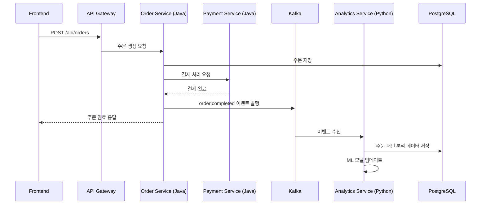

# 하이브리드 아키텍처 설계서
# Java Spring Boot (메인) + Python Flask (보조)

**문서 버전**: v1.0  
**작성일**: 2025-11-20  
**프로젝트**: K-Food 거래 플랫폼 (XLCfi)

---

## 목차

1. [아키텍처 개요](#1-아키텍처-개요)
2. [역할 분담](#2-역할-분담)
3. [기술 스택 구성](#3-기술-스택-구성)
4. [시스템 구조](#4-시스템-구조)
5. [통신 방식](#5-통신-방식)
6. [데이터 흐름](#6-데이터-흐름)
7. [장단점 분석](#7-장단점-분석)
8. [구현 가이드](#8-구현-가이드)
9. [배포 전략](#9-배포-전략)
10. [운영 관리](#10-운영-관리)

---

## 1. 아키텍처 개요

### 1.1 기본 전략

```
┌────────────────────────────────────────────────────────────────┐
│                    하이브리드 아키텍처                           │
│                                                                  │
│  ┌──────────────────────┐    ┌──────────────────────┐         │
│  │   Java Spring Boot   │    │    Python Flask      │         │
│  │      (메인 엔진)      │◄───┤   (데이터 엔진)       │         │
│  │                      │    │                      │         │
│  │  - 비즈니스 로직      │    │  - 데이터 분석        │         │
│  │  - 트랜잭션 처리      │    │  - ML/AI 처리         │         │
│  │  - 결제/주문         │    │  - 추천 엔진          │         │
│  │  - 블록체인 연동      │    │  - 통계/리포트        │         │
│  │  - 사용자 관리        │    │  - 이미지 처리        │         │
│  └──────────────────────┘    └──────────────────────┘         │
│           ▲                            ▲                        │
│           │                            │                        │
│           ▼                            ▼                        │
│  ┌────────────────────────────────────────────┐               │
│  │         공유 데이터베이스 (PostgreSQL)       │               │
│  └────────────────────────────────────────────┘               │
└────────────────────────────────────────────────────────────────┘
```

### 1.2 핵심 원칙

1. **명확한 역할 분담**: 각 기술의 강점을 최대한 활용
2. **느슨한 결합**: REST API 또는 Message Queue로 통신
3. **독립적 배포**: 각 서비스 독립적으로 확장/배포 가능
4. **데이터 일관성**: 공유 DB 또는 API로 데이터 동기화

---

## 2. 역할 분담

### 2.1 Java Spring Boot (메인 비즈니스 로직)

#### 담당 영역

```yaml
핵심 비즈니스 로직:
  - 회원 관리 (인증, 권한, 프로필)
  - 상품 관리 (CRUD, 재고 관리)
  - 주문 관리 (주문 생성, 상태 변경)
  - 결제 처리 (PG 연동, 트랜잭션)
  - 블록체인 연동 (Web3j, 스마트 컨트랙트)
  - 리뷰 관리 (작성, 조회, 신고)

보안 및 인증:
  - JWT 토큰 발급/검증
  - Spring Security 기반 인증
  - OAuth2 소셜 로그인
  - API Rate Limiting

트랜잭션 관리:
  - 주문-결제 2PC (Two-Phase Commit)
  - 재고 감소 트랜잭션
  - 포인트 적립/차감

실시간 처리:
  - WebSocket (주문 알림)
  - Server-Sent Events (상태 업데이트)
```

#### 기술 스택

```yaml
Core:
  - Java 17 LTS
  - Spring Boot 3.2.x
  - Spring Data JPA
  - Spring Security
  - Spring Cloud (마이크로서비스)

Database:
  - PostgreSQL (Primary)
  - Redis (Cache, Session)
  - Elasticsearch (Search)

Blockchain:
  - Web3j 4.10.x
  - Ethereum / Polygon

Monitoring:
  - Spring Boot Actuator
  - Prometheus + Grafana
```

### 2.2 Python Flask (데이터 분석 및 보조)

#### 담당 영역

```yaml
데이터 분석:
  - 매출 분석 및 리포팅
  - 사용자 행동 분석
  - 상품 판매 트렌드 분석
  - 대시보드 데이터 생성

추천 시스템:
  - 상품 추천 (협업 필터링)
  - 개인화 추천 (Content-based)
  - 연관 상품 추천
  - 인기 상품 예측

머신러닝:
  - 가격 최적화 예측
  - 재고 예측
  - 이탈 고객 예측
  - 리뷰 감정 분석

이미지 처리:
  - 상품 이미지 자동 태깅
  - 이미지 품질 검증
  - OCR (영양성분표 추출)
  - 이미지 유사도 검색

데이터 ETL:
  - 외부 데이터 수집
  - 데이터 전처리
  - 데이터 정제
  - 배치 처리

통계 및 리포팅:
  - 주간/월간 리포트 생성
  - CSV/Excel 내보내기
  - 데이터 시각화 API
```

#### 기술 스택

```yaml
Core:
  - Python 3.11+
  - Flask 3.x
  - SQLAlchemy (ORM)
  - Flask-CORS
  - Flask-RESTful

데이터 분석:
  - Pandas (데이터 처리)
  - NumPy (수치 연산)
  - Scikit-learn (ML)
  - TensorFlow / PyTorch (딥러닝)

데이터 시각화:
  - Matplotlib
  - Seaborn
  - Plotly

이미지 처리:
  - Pillow (이미지 조작)
  - OpenCV (컴퓨터 비전)
  - Tesseract (OCR)

자연어 처리:
  - KoNLPy (한국어 형태소 분석)
  - spaCy
  - Transformers (BERT, GPT)

Task Queue:
  - Celery (비동기 작업)
  - Redis (메시지 브로커)
```

---

## 3. 기술 스택 구성

### 3.1 전체 기술 스택

```
┌─────────────────────────────────────────────────────────────┐
│                         Frontend                             │
│                      Next.js + React                         │
└─────────────────────────────────────────────────────────────┘
                              │
                              ▼
┌─────────────────────────────────────────────────────────────┐
│                      API Gateway                             │
│              Spring Cloud Gateway (Java)                     │
└─────────────────────────────────────────────────────────────┘
                              │
                 ┌────────────┴────────────┐
                 ▼                         ▼
┌──────────────────────────┐   ┌──────────────────────────┐
│   Java Spring Boot       │   │     Python Flask         │
│   (메인 서비스)           │   │   (데이터 서비스)         │
├──────────────────────────┤   ├──────────────────────────┤
│ - Auth Service           │   │ - Analytics Service      │
│ - Product Service        │   │ - Recommendation Service │
│ - Order Service          │   │ - ML Service             │
│ - Payment Service        │   │ - Image Processing       │
│ - Blockchain Service     │   │ - Report Service         │
│ - Review Service         │   │ - ETL Service            │
│ - Admin Service          │   │                          │
└──────────────────────────┘   └──────────────────────────┘
                 │                         │
                 ▼                         ▼
┌─────────────────────────────────────────────────────────────┐
│                      Data Layer                              │
├─────────────────────────────────────────────────────────────┤
│ PostgreSQL (Primary)  │  Redis (Cache)  │  Elasticsearch    │
│ MongoDB (Logs)        │  S3 (Files)     │  Kafka (Events)   │
└─────────────────────────────────────────────────────────────┘
```

### 3.2 통신 프로토콜

```yaml
동기 통신:
  - REST API (HTTP/HTTPS)
  - gRPC (고성능 필요시)
  - GraphQL (선택적)

비동기 통신:
  - Apache Kafka (이벤트 스트리밍)
  - RabbitMQ (작업 큐)
  - Redis Pub/Sub (실시간 알림)

데이터 공유:
  - 공유 PostgreSQL DB
  - Redis Cache
  - API 호출
```

---

## 4. 시스템 구조

### 4.1 계층 구조

```
┌─────────────────────────────────────────────────────────────┐
│                    Presentation Layer                        │
│              Next.js (SSR, CSR, Static)                      │
└─────────────────────────────────────────────────────────────┘
                              │
                              ▼
┌─────────────────────────────────────────────────────────────┐
│                      API Gateway Layer                       │
│          Spring Cloud Gateway + Load Balancer               │
│          - Routing, Authentication, Rate Limiting            │
└─────────────────────────────────────────────────────────────┘
                              │
                 ┌────────────┴────────────┐
                 ▼                         ▼
┌──────────────────────────┐   ┌──────────────────────────┐
│   Business Logic Layer   │   │    Data Service Layer    │
│    (Java Spring Boot)    │   │     (Python Flask)       │
│                          │   │                          │
│  - 트랜잭션 처리          │   │  - 데이터 분석            │
│  - 비즈니스 규칙          │   │  - ML/AI 처리            │
│  - 결제/주문             │   │  - 리포팅                │
│  - 블록체인              │   │  - 배치 작업             │
└──────────────────────────┘   └──────────────────────────┘
                 │                         │
                 └────────────┬────────────┘
                              ▼
┌─────────────────────────────────────────────────────────────┐
│                    Data Access Layer                         │
│             JPA (Java) + SQLAlchemy (Python)                 │
└─────────────────────────────────────────────────────────────┘
                              │
                              ▼
┌─────────────────────────────────────────────────────────────┐
│                      Database Layer                          │
│    PostgreSQL + Redis + Elasticsearch + MongoDB              │
└─────────────────────────────────────────────────────────────┘
```

### 4.2 마이크로서비스 맵

```
xlcfi-platform/
├── java-services/
│   ├── api-gateway/              # Spring Cloud Gateway
│   ├── auth-service/             # 인증/권한 (Port: 8081)
│   ├── product-service/          # 상품 관리 (Port: 8082)
│   ├── order-service/            # 주문 관리 (Port: 8083)
│   ├── payment-service/          # 결제 (Port: 8084)
│   ├── blockchain-service/       # 블록체인 (Port: 8085)
│   ├── review-service/           # 리뷰 (Port: 8086)
│   └── admin-service/            # 관리자 (Port: 8087)
│
├── python-services/
│   ├── analytics-service/        # 분석 (Port: 5001)
│   ├── recommendation-service/   # 추천 (Port: 5002)
│   ├── ml-service/               # ML (Port: 5003)
│   ├── image-service/            # 이미지 처리 (Port: 5004)
│   ├── report-service/           # 리포트 (Port: 5005)
│   └── etl-service/              # ETL (Port: 5006)
│
├── frontend/
│   └── next-app/                 # Next.js (Port: 3000)
│
└── infrastructure/
    ├── docker-compose.yml
    ├── kubernetes/
    └── monitoring/
```

---

## 5. 통신 방식

### 5.1 Java → Python 통신

#### 시나리오 1: 동기 REST API 호출

```java
// Java Spring Boot - 추천 상품 조회
@Service
public class RecommendationClientService {
    
    @Autowired
    private RestTemplate restTemplate;
    
    @Value("${python.recommendation.url}")
    private String recommendationServiceUrl;
    
    public List<ProductDto> getRecommendations(Long userId) {
        String url = recommendationServiceUrl + "/api/recommendations/" + userId;
        
        ResponseEntity<List<ProductDto>> response = restTemplate.exchange(
            url,
            HttpMethod.GET,
            null,
            new ParameterizedTypeReference<List<ProductDto>>() {}
        );
        
        return response.getBody();
    }
}
```

```python
# Python Flask - 추천 API
from flask import Flask, jsonify
from recommendation_engine import get_user_recommendations

app = Flask(__name__)

@app.route('/api/recommendations/<int:user_id>', methods=['GET'])
def get_recommendations(user_id):
    """사용자 맞춤 상품 추천"""
    recommendations = get_user_recommendations(user_id)
    return jsonify(recommendations), 200
```

#### 시나리오 2: 비동기 이벤트 기반 (Kafka)

```java
// Java - 주문 완료 이벤트 발행
@Service
public class OrderService {
    
    @Autowired
    private KafkaTemplate<String, OrderEvent> kafkaTemplate;
    
    public void createOrder(Order order) {
        // 주문 생성 로직
        orderRepository.save(order);
        
        // 이벤트 발행 (Python이 구독)
        OrderEvent event = new OrderEvent(order.getId(), order.getUserId(), order.getTotal());
        kafkaTemplate.send("order.completed", event);
    }
}
```

```python
# Python - 주문 이벤트 구독
from kafka import KafkaConsumer
import json

consumer = KafkaConsumer(
    'order.completed',
    bootstrap_servers=['localhost:9092'],
    value_deserializer=lambda m: json.loads(m.decode('utf-8'))
)

for message in consumer:
    order_event = message.value
    # 주문 데이터 분석 및 저장
    analyze_order_pattern(order_event)
    update_user_profile(order_event['user_id'])
```

### 5.2 Python → Java 통신

```python
# Python - Java 서비스 호출 (상품 정보 조회)
import requests

def get_product_details(product_id):
    """Java Product Service에서 상품 정보 가져오기"""
    url = f"http://product-service:8082/api/products/{product_id}"
    headers = {"Authorization": f"Bearer {get_internal_token()}"}
    
    response = requests.get(url, headers=headers)
    if response.status_code == 200:
        return response.json()
    else:
        return None
```

### 5.3 API Gateway 라우팅

```yaml
# Spring Cloud Gateway 라우팅 설정
spring:
  cloud:
    gateway:
      routes:
        # Java 서비스
        - id: product-service
          uri: lb://PRODUCT-SERVICE
          predicates:
            - Path=/api/products/**
        
        - id: order-service
          uri: lb://ORDER-SERVICE
          predicates:
            - Path=/api/orders/**
        
        # Python 서비스
        - id: analytics-service
          uri: http://analytics-service:5001
          predicates:
            - Path=/api/analytics/**
        
        - id: recommendation-service
          uri: http://recommendation-service:5002
          predicates:
            - Path=/api/recommendations/**
```

---

## 6. 데이터 흐름

### 6.1 시나리오: 상품 추천 시스템

```
1. 사용자가 상품 조회
   Frontend → API Gateway → Product Service (Java)
   
2. 상품 조회 이벤트 기록
   Product Service (Java) → Kafka → Analytics Service (Python)
   
3. 사용자 행동 패턴 분석
   Analytics Service (Python) → PostgreSQL (행동 데이터 저장)
   
4. ML 모델로 추천 생성
   Recommendation Service (Python) → ML Model → Redis (캐시)
   
5. 프론트엔드에서 추천 상품 표시
   Frontend → API Gateway → Recommendation Service (Python)
   Frontend → API Gateway → Product Service (Java) (상품 상세)
```

### 6.2 시나리오: 주문 생성 및 분석



### 6.3 시나리오: 관리자 대시보드

```python
# Python - 대시보드 데이터 생성
from flask import Flask, jsonify
from sqlalchemy import create_engine
import pandas as pd

@app.route('/api/analytics/dashboard', methods=['GET'])
def get_dashboard_data():
    """관리자 대시보드 데이터"""
    engine = create_engine(DATABASE_URL)
    
    # 매출 통계 (최근 30일)
    sales_query = """
        SELECT DATE(created_at) as date, SUM(total) as revenue
        FROM orders
        WHERE created_at >= NOW() - INTERVAL '30 days'
        GROUP BY DATE(created_at)
        ORDER BY date
    """
    sales_df = pd.read_sql(sales_query, engine)
    
    # 인기 상품 TOP 10
    popular_query = """
        SELECT p.id, p.name, COUNT(oi.id) as order_count
        FROM products p
        JOIN order_items oi ON p.id = oi.product_id
        JOIN orders o ON oi.order_id = o.id
        WHERE o.created_at >= NOW() - INTERVAL '30 days'
        GROUP BY p.id, p.name
        ORDER BY order_count DESC
        LIMIT 10
    """
    popular_df = pd.read_sql(popular_query, engine)
    
    return jsonify({
        'sales_trend': sales_df.to_dict('records'),
        'popular_products': popular_df.to_dict('records'),
        'total_revenue': float(sales_df['revenue'].sum()),
        'avg_order_value': float(sales_df['revenue'].mean())
    })
```

```java
// Java - 관리자 서비스에서 Python 데이터 가져오기
@RestController
@RequestMapping("/api/admin/dashboard")
public class AdminDashboardController {
    
    @Autowired
    private RestTemplate restTemplate;
    
    @GetMapping
    public ResponseEntity<DashboardDto> getDashboard() {
        // Python Analytics Service에서 데이터 가져오기
        String analyticsUrl = "http://analytics-service:5001/api/analytics/dashboard";
        DashboardDto analytics = restTemplate.getForObject(analyticsUrl, DashboardDto.class);
        
        // Java 서비스에서 실시간 데이터 추가
        analytics.setPendingOrders(orderService.countPendingOrders());
        analytics.setActiveUsers(userService.countActiveUsers());
        
        return ResponseEntity.ok(analytics);
    }
}
```

---

## 7. 장단점 분석

### 7.1 하이브리드 아키텍처 장점

```yaml
기술적 장점:
  ✓ 각 언어의 강점 활용
    - Java: 안정적 트랜잭션, 엔터프라이즈급 보안
    - Python: 빠른 데이터 분석, 풍부한 ML 라이브러리
  
  ✓ 독립적 확장성
    - 트래픽에 따라 서비스별 스케일링
    - Java와 Python 서비스 독립 배포
  
  ✓ 기술 선택의 유연성
    - 새로운 요구사항에 맞는 기술 선택
    - 레거시 코드 영향 최소화

비즈니스 장점:
  ✓ 개발 속도 향상
    - 팀별 병렬 개발 가능
    - 적재적소 기술 활용
  
  ✓ 유지보수 용이
    - 서비스별 독립적 유지보수
    - 장애 격리 (Fault Isolation)
  
  ✓ 인력 활용
    - Java 개발자: 비즈니스 로직
    - Python 개발자: 데이터 분석/ML

운영 장점:
  ✓ 점진적 마이그레이션
    - Phase별 서비스 추가
    - 위험 분산
  
  ✓ 모니터링 및 디버깅
    - 서비스별 독립 모니터링
    - 문제 원인 파악 용이
```

### 7.2 하이브리드 아키텍처 단점 및 해결책

```yaml
복잡성 증가:
  ⚠ 문제: 두 개의 기술 스택 관리
  ✓ 해결: 
    - Docker/Kubernetes로 표준화
    - CI/CD 파이프라인 자동화
    - 명확한 문서화

통신 오버헤드:
  ⚠ 문제: 서비스 간 네트워크 호출 지연
  ✓ 해결:
    - Redis 캐싱 적극 활용
    - 비동기 통신 (Kafka)
    - gRPC 사용 (필요시)

데이터 일관성:
  ⚠ 문제: 서비스 간 데이터 동기화
  ✓ 해결:
    - 공유 PostgreSQL DB
    - Event Sourcing (Kafka)
    - Saga Pattern (분산 트랜잭션)

개발자 스킬셋:
  ⚠ 문제: 두 언어 모두 알아야 함
  ✓ 해결:
    - 팀별 전문화 (Java팀, Python팀)
    - API 명세서 명확화
    - 상호 교육 프로그램

배포 복잡도:
  ⚠ 문제: 여러 서비스 배포 관리
  ✓ 해결:
    - Kubernetes Helm Charts
    - GitOps (ArgoCD)
    - 자동화된 배포 스크립트
```

### 7.3 단일 스택과 비교

| 항목 | Java Only | Python Only | 하이브리드 (추천) |
|------|-----------|-------------|------------------|
| 트랜잭션 안정성 | ⭐⭐⭐⭐⭐ | ⭐⭐⭐ | ⭐⭐⭐⭐⭐ |
| 데이터 분석 | ⭐⭐ | ⭐⭐⭐⭐⭐ | ⭐⭐⭐⭐⭐ |
| ML/AI 지원 | ⭐⭐ | ⭐⭐⭐⭐⭐ | ⭐⭐⭐⭐⭐ |
| 블록체인 통합 | ⭐⭐⭐⭐⭐ | ⭐⭐⭐ | ⭐⭐⭐⭐⭐ |
| 개발 속도 | ⭐⭐⭐ | ⭐⭐⭐⭐ | ⭐⭐⭐⭐ |
| 유지보수성 | ⭐⭐⭐⭐ | ⭐⭐⭐ | ⭐⭐⭐⭐ |
| 학습 곡선 | ⭐⭐ | ⭐⭐⭐⭐ | ⭐⭐⭐ |
| 복잡도 | ⭐⭐⭐ | ⭐⭐⭐⭐ | ⭐⭐ |
| 확장성 | ⭐⭐⭐⭐ | ⭐⭐⭐ | ⭐⭐⭐⭐⭐ |
| 인력 확보 | ⭐⭐⭐⭐ | ⭐⭐⭐⭐ | ⭐⭐⭐⭐ |

---

## 8. 구현 가이드

### 8.1 Phase 1: 기본 인프라 구축

#### Step 1: 개발 환경 설정

```yaml
# docker-compose.yml
version: '3.8'

services:
  # 데이터베이스
  postgres:
    image: postgres:15-alpine
    environment:
      POSTGRES_DB: xlcfi_db
      POSTGRES_USER: xlcfi_user
      POSTGRES_PASSWORD: xlcfi_pass
    ports:
      - "5432:5432"
    volumes:
      - postgres_data:/var/lib/postgresql/data
  
  # 캐시
  redis:
    image: redis:7-alpine
    ports:
      - "6379:6379"
  
  # 메시지 큐
  kafka:
    image: confluentinc/cp-kafka:7.5.0
    depends_on:
      - zookeeper
    environment:
      KAFKA_ZOOKEEPER_CONNECT: zookeeper:2181
      KAFKA_ADVERTISED_LISTENERS: PLAINTEXT://localhost:9092
    ports:
      - "9092:9092"
  
  zookeeper:
    image: confluentinc/cp-zookeeper:7.5.0
    environment:
      ZOOKEEPER_CLIENT_PORT: 2181
  
  # Elasticsearch
  elasticsearch:
    image: elasticsearch:8.11.0
    environment:
      - discovery.type=single-node
      - xpack.security.enabled=false
    ports:
      - "9200:9200"

volumes:
  postgres_data:
```

#### Step 2: Java 프로젝트 구조

```
java-services/
├── api-gateway/
│   ├── src/main/java/com/xlcfi/gateway/
│   │   ├── GatewayApplication.java
│   │   ├── config/
│   │   │   ├── SecurityConfig.java
│   │   │   └── RouteConfig.java
│   │   └── filter/
│   │       └── AuthenticationFilter.java
│   └── pom.xml
│
├── product-service/
│   ├── src/main/java/com/xlcfi/product/
│   │   ├── ProductServiceApplication.java
│   │   ├── controller/
│   │   ├── service/
│   │   ├── repository/
│   │   ├── domain/
│   │   └── dto/
│   └── pom.xml
│
└── common/
    └── src/main/java/com/xlcfi/common/
        ├── dto/
        ├── exception/
        └── util/
```

#### Step 3: Python 프로젝트 구조

```
python-services/
├── analytics-service/
│   ├── app/
│   │   ├── __init__.py
│   │   ├── main.py
│   │   ├── api/
│   │   │   ├── __init__.py
│   │   │   └── analytics.py
│   │   ├── models/
│   │   ├── services/
│   │   └── utils/
│   ├── requirements.txt
│   └── Dockerfile
│
├── recommendation-service/
│   ├── app/
│   │   ├── __init__.py
│   │   ├── main.py
│   │   ├── api/
│   │   ├── ml_models/
│   │   └── data_processing/
│   └── requirements.txt
│
└── common/
    ├── database.py
    ├── kafka_client.py
    └── redis_client.py
```

### 8.2 Phase 2: 서비스 간 통신 구현

#### Java → Python 통신 라이브러리

```java
// Java - PythonServiceClient.java
@Component
public class PythonServiceClient {
    
    private final RestTemplate restTemplate;
    private final String pythonServiceBaseUrl;
    
    public PythonServiceClient(RestTemplate restTemplate,
                               @Value("${python.service.url}") String pythonServiceBaseUrl) {
        this.restTemplate = restTemplate;
        this.pythonServiceBaseUrl = pythonServiceBaseUrl;
    }
    
    public <T> T get(String endpoint, Class<T> responseType) {
        String url = pythonServiceBaseUrl + endpoint;
        return restTemplate.getForObject(url, responseType);
    }
    
    public <T, R> R post(String endpoint, T request, Class<R> responseType) {
        String url = pythonServiceBaseUrl + endpoint;
        return restTemplate.postForObject(url, request, responseType);
    }
    
    // Circuit Breaker 패턴 적용
    @CircuitBreaker(name = "pythonService", fallbackMethod = "fallback")
    public <T> T getWithFallback(String endpoint, Class<T> responseType) {
        return get(endpoint, responseType);
    }
    
    private <T> T fallback(String endpoint, Class<T> responseType, Exception e) {
        log.error("Python service call failed: {}", e.getMessage());
        return null; // 또는 기본값 반환
    }
}
```

#### Python → Java 통신 라이브러리

```python
# Python - java_client.py
import requests
from typing import Optional, Dict, Any
import logging

logger = logging.getLogger(__name__)

class JavaServiceClient:
    def __init__(self, base_url: str, timeout: int = 10):
        self.base_url = base_url
        self.timeout = timeout
        self.session = requests.Session()
    
    def _get_headers(self, token: Optional[str] = None) -> Dict[str, str]:
        headers = {"Content-Type": "application/json"}
        if token:
            headers["Authorization"] = f"Bearer {token}"
        return headers
    
    def get(self, endpoint: str, token: Optional[str] = None) -> Optional[Dict[Any, Any]]:
        """GET 요청"""
        try:
            url = f"{self.base_url}{endpoint}"
            response = self.session.get(
                url,
                headers=self._get_headers(token),
                timeout=self.timeout
            )
            response.raise_for_status()
            return response.json()
        except requests.exceptions.RequestException as e:
            logger.error(f"Java service call failed: {e}")
            return None
    
    def post(self, endpoint: str, data: Dict[Any, Any], token: Optional[str] = None) -> Optional[Dict[Any, Any]]:
        """POST 요청"""
        try:
            url = f"{self.base_url}{endpoint}"
            response = self.session.post(
                url,
                json=data,
                headers=self._get_headers(token),
                timeout=self.timeout
            )
            response.raise_for_status()
            return response.json()
        except requests.exceptions.RequestException as e:
            logger.error(f"Java service call failed: {e}")
            return None

# 사용 예시
product_client = JavaServiceClient(base_url="http://product-service:8082")
product = product_client.get("/api/products/1")
```

### 8.3 Phase 3: 데이터 동기화

#### Kafka 이벤트 발행 (Java)

```java
// OrderEventProducer.java
@Service
public class OrderEventProducer {
    
    @Autowired
    private KafkaTemplate<String, OrderEvent> kafkaTemplate;
    
    public void publishOrderCompleted(Order order) {
        OrderEvent event = OrderEvent.builder()
            .orderId(order.getId())
            .userId(order.getBuyerId())
            .total(order.getTotal())
            .items(order.getItems())
            .timestamp(LocalDateTime.now())
            .build();
        
        kafkaTemplate.send("order.completed", event);
        log.info("Published order completed event: {}", order.getId());
    }
}
```

#### Kafka 이벤트 구독 (Python)

```python
# order_consumer.py
from kafka import KafkaConsumer
import json
import logging
from analytics_service import analyze_order

logger = logging.getLogger(__name__)

def start_order_consumer():
    consumer = KafkaConsumer(
        'order.completed',
        bootstrap_servers=['kafka:9092'],
        auto_offset_reset='earliest',
        enable_auto_commit=True,
        group_id='analytics-group',
        value_deserializer=lambda x: json.loads(x.decode('utf-8'))
    )
    
    logger.info("Started order event consumer")
    
    for message in consumer:
        try:
            order_event = message.value
            logger.info(f"Received order event: {order_event['orderId']}")
            
            # 주문 데이터 분석
            analyze_order(order_event)
            
            # 사용자 프로필 업데이트
            update_user_profile(order_event['userId'])
            
            # 추천 모델 재학습 트리거
            trigger_model_retrain()
            
        except Exception as e:
            logger.error(f"Error processing order event: {e}")

if __name__ == '__main__':
    start_order_consumer()
```

---

## 9. 배포 전략

### 9.1 Docker 이미지

#### Java Dockerfile

```dockerfile
# java-services/product-service/Dockerfile
FROM gradle:8.5-jdk17 AS builder
WORKDIR /app
COPY . .
RUN gradle clean build -x test --no-daemon

FROM eclipse-temurin:17-jre-alpine
WORKDIR /app
COPY --from=builder /app/build/libs/*.jar app.jar

ENV JAVA_OPTS="-Xms512m -Xmx1024m -XX:+UseG1GC"
EXPOSE 8082

ENTRYPOINT ["sh", "-c", "java $JAVA_OPTS -jar app.jar"]
```

#### Python Dockerfile

```dockerfile
# python-services/analytics-service/Dockerfile
FROM python:3.11-slim

WORKDIR /app

# 시스템 패키지
RUN apt-get update && apt-get install -y \
    gcc \
    libpq-dev \
    && rm -rf /var/lib/apt/lists/*

# Python 의존성
COPY requirements.txt .
RUN pip install --no-cache-dir -r requirements.txt

# 애플리케이션 코드
COPY ./app ./app

EXPOSE 5001

CMD ["python", "-m", "app.main"]
```

### 9.2 Kubernetes 배포

#### Java Service Deployment

```yaml
# k8s/product-service-deployment.yaml
apiVersion: apps/v1
kind: Deployment
metadata:
  name: product-service
  labels:
    app: product-service
spec:
  replicas: 3
  selector:
    matchLabels:
      app: product-service
  template:
    metadata:
      labels:
        app: product-service
    spec:
      containers:
      - name: product-service
        image: xlcfi/product-service:1.0.0
        ports:
        - containerPort: 8082
        env:
        - name: SPRING_PROFILES_ACTIVE
          value: "prod"
        - name: DATABASE_URL
          valueFrom:
            secretKeyRef:
              name: db-secret
              key: url
        resources:
          requests:
            memory: "512Mi"
            cpu: "500m"
          limits:
            memory: "1Gi"
            cpu: "1000m"
        livenessProbe:
          httpGet:
            path: /actuator/health/liveness
            port: 8082
          initialDelaySeconds: 30
          periodSeconds: 10
        readinessProbe:
          httpGet:
            path: /actuator/health/readiness
            port: 8082
          initialDelaySeconds: 20
          periodSeconds: 5

---
apiVersion: v1
kind: Service
metadata:
  name: product-service
spec:
  selector:
    app: product-service
  ports:
  - port: 8082
    targetPort: 8082
  type: ClusterIP
```

#### Python Service Deployment

```yaml
# k8s/analytics-service-deployment.yaml
apiVersion: apps/v1
kind: Deployment
metadata:
  name: analytics-service
  labels:
    app: analytics-service
spec:
  replicas: 2
  selector:
    matchLabels:
      app: analytics-service
  template:
    metadata:
      labels:
        app: analytics-service
    spec:
      containers:
      - name: analytics-service
        image: xlcfi/analytics-service:1.0.0
        ports:
        - containerPort: 5001
        env:
        - name: DATABASE_URL
          valueFrom:
            secretKeyRef:
              name: db-secret
              key: url
        - name: KAFKA_BOOTSTRAP_SERVERS
          value: "kafka:9092"
        resources:
          requests:
            memory: "256Mi"
            cpu: "250m"
          limits:
            memory: "512Mi"
            cpu: "500m"
        livenessProbe:
          httpGet:
            path: /health
            port: 5001
          initialDelaySeconds: 20
          periodSeconds: 10

---
apiVersion: v1
kind: Service
metadata:
  name: analytics-service
spec:
  selector:
    app: analytics-service
  ports:
  - port: 5001
    targetPort: 5001
  type: ClusterIP
```

### 9.3 CI/CD 파이프라인

```yaml
# .github/workflows/deploy.yml
name: Deploy Services

on:
  push:
    branches: [main]

jobs:
  deploy-java:
    runs-on: ubuntu-latest
    steps:
      - uses: actions/checkout@v3
      
      - name: Set up JDK 17
        uses: actions/setup-java@v3
        with:
          java-version: '17'
          distribution: 'temurin'
      
      - name: Build with Gradle
        run: |
          cd java-services/product-service
          gradle clean build -x test
      
      - name: Build Docker image
        run: |
          docker build -t xlcfi/product-service:${{ github.sha }} .
          docker tag xlcfi/product-service:${{ github.sha }} xlcfi/product-service:latest
      
      - name: Push to Docker Hub
        run: |
          echo ${{ secrets.DOCKER_PASSWORD }} | docker login -u ${{ secrets.DOCKER_USERNAME }} --password-stdin
          docker push xlcfi/product-service:latest
      
      - name: Deploy to Kubernetes
        run: |
          kubectl set image deployment/product-service product-service=xlcfi/product-service:${{ github.sha }}
  
  deploy-python:
    runs-on: ubuntu-latest
    steps:
      - uses: actions/checkout@v3
      
      - name: Set up Python
        uses: actions/setup-python@v4
        with:
          python-version: '3.11'
      
      - name: Build Docker image
        run: |
          cd python-services/analytics-service
          docker build -t xlcfi/analytics-service:${{ github.sha }} .
          docker tag xlcfi/analytics-service:${{ github.sha }} xlcfi/analytics-service:latest
      
      - name: Push to Docker Hub
        run: |
          docker push xlcfi/analytics-service:latest
      
      - name: Deploy to Kubernetes
        run: |
          kubectl set image deployment/analytics-service analytics-service=xlcfi/analytics-service:${{ github.sha }}
```

---

## 10. 운영 관리

### 10.1 모니터링

#### Prometheus 설정

```yaml
# prometheus.yml
global:
  scrape_interval: 15s

scrape_configs:
  # Java Spring Boot Actuator
  - job_name: 'spring-boot'
    metrics_path: '/actuator/prometheus'
    static_configs:
      - targets:
        - 'product-service:8082'
        - 'order-service:8083'
        - 'payment-service:8084'
  
  # Python Flask (prometheus_client)
  - job_name: 'flask'
    metrics_path: '/metrics'
    static_configs:
      - targets:
        - 'analytics-service:5001'
        - 'recommendation-service:5002'
```

#### Python 메트릭 수집

```python
# Python - metrics.py
from prometheus_client import Counter, Histogram, Gauge, generate_latest
from flask import Response
import time

# 메트릭 정의
REQUEST_COUNT = Counter(
    'analytics_request_total',
    'Total analytics requests',
    ['method', 'endpoint', 'status']
)

REQUEST_LATENCY = Histogram(
    'analytics_request_latency_seconds',
    'Analytics request latency',
    ['method', 'endpoint']
)

ACTIVE_USERS = Gauge(
    'analytics_active_users',
    'Number of active users'
)

@app.route('/metrics')
def metrics():
    """Prometheus 메트릭 엔드포인트"""
    return Response(generate_latest(), mimetype='text/plain')

# 데코레이터로 자동 메트릭 수집
def track_metrics(func):
    def wrapper(*args, **kwargs):
        method = request.method
        endpoint = request.endpoint
        
        start_time = time.time()
        try:
            result = func(*args, **kwargs)
            status = result[1] if isinstance(result, tuple) else 200
            REQUEST_COUNT.labels(method, endpoint, status).inc()
            return result
        except Exception as e:
            REQUEST_COUNT.labels(method, endpoint, 500).inc()
            raise
        finally:
            REQUEST_LATENCY.labels(method, endpoint).observe(time.time() - start_time)
    
    return wrapper

@app.route('/api/analytics/<int:user_id>')
@track_metrics
def get_user_analytics(user_id):
    # ...
    pass
```

### 10.2 로깅

#### Java (Logback)

```xml
<!-- logback-spring.xml -->
<configuration>
    <appender name="CONSOLE" class="ch.qos.logback.core.ConsoleAppender">
        <encoder>
            <pattern>%d{yyyy-MM-dd HH:mm:ss} [%thread] %-5level %logger{36} - %msg%n</pattern>
        </encoder>
    </appender>
    
    <appender name="FILE" class="ch.qos.logback.core.rolling.RollingFileAppender">
        <file>logs/product-service.log</file>
        <rollingPolicy class="ch.qos.logback.core.rolling.TimeBasedRollingPolicy">
            <fileNamePattern>logs/product-service-%d{yyyy-MM-dd}.log</fileNamePattern>
            <maxHistory>30</maxHistory>
        </rollingPolicy>
        <encoder>
            <pattern>%d{yyyy-MM-dd HH:mm:ss} [%thread] %-5level %logger{36} - %msg%n</pattern>
        </encoder>
    </appender>
    
    <!-- ELK Stack으로 전송 -->
    <appender name="LOGSTASH" class="net.logstash.logback.appender.LogstashTcpSocketAppender">
        <destination>logstash:5000</destination>
        <encoder class="net.logstash.logback.encoder.LogstashEncoder" />
    </appender>
    
    <root level="INFO">
        <appender-ref ref="CONSOLE" />
        <appender-ref ref="FILE" />
        <appender-ref ref="LOGSTASH" />
    </root>
</configuration>
```

#### Python (구조화된 로깅)

```python
# logging_config.py
import logging
import json
from datetime import datetime

class StructuredFormatter(logging.Formatter):
    def format(self, record):
        log_data = {
            'timestamp': datetime.utcnow().isoformat(),
            'level': record.levelname,
            'service': 'analytics-service',
            'message': record.getMessage(),
            'logger': record.name,
            'function': record.funcName,
            'line': record.lineno
        }
        
        if hasattr(record, 'user_id'):
            log_data['user_id'] = record.user_id
        
        if record.exc_info:
            log_data['exception'] = self.formatException(record.exc_info)
        
        return json.dumps(log_data)

# 설정
handler = logging.StreamHandler()
handler.setFormatter(StructuredFormatter())

logger = logging.getLogger('analytics')
logger.addHandler(handler)
logger.setLevel(logging.INFO)

# 사용 예시
logger.info('User analytics generated', extra={'user_id': 123})
```

### 10.3 알림 설정

```yaml
# alertmanager.yml
route:
  receiver: 'slack'
  group_by: ['alertname', 'service']
  group_wait: 10s
  group_interval: 5m
  repeat_interval: 3h

receivers:
  - name: 'slack'
    slack_configs:
      - api_url: 'https://hooks.slack.com/services/YOUR/WEBHOOK/URL'
        channel: '#alerts'
        title: 'Alert: {{ .GroupLabels.alertname }}'
        text: '{{ range .Alerts }}{{ .Annotations.description }}{{ end }}'

# Prometheus 알림 규칙
groups:
  - name: service_alerts
    rules:
      # Java 서비스 다운
      - alert: JavaServiceDown
        expr: up{job="spring-boot"} == 0
        for: 1m
        labels:
          severity: critical
        annotations:
          description: "Java service {{ $labels.instance }} is down"
      
      # Python 서비스 다운
      - alert: PythonServiceDown
        expr: up{job="flask"} == 0
        for: 1m
        labels:
          severity: critical
        annotations:
          description: "Python service {{ $labels.instance }} is down"
      
      # 높은 에러율
      - alert: HighErrorRate
        expr: rate(http_requests_total{status=~"5.."}[5m]) > 0.1
        for: 5m
        labels:
          severity: warning
        annotations:
          description: "High error rate on {{ $labels.service }}"
```

---

## 11. 보안

### 11.1 서비스 간 인증

#### JWT 기반 Internal Token

```java
// Java - InternalAuthService.java
@Service
public class InternalAuthService {
    
    @Value("${internal.jwt.secret}")
    private String internalSecret;
    
    public String generateInternalToken() {
        return Jwts.builder()
            .setSubject("internal-service")
            .claim("role", "SERVICE")
            .setIssuedAt(new Date())
            .setExpiration(new Date(System.currentTimeMillis() + 3600000)) // 1시간
            .signWith(SignatureAlgorithm.HS512, internalSecret)
            .compact();
    }
    
    public boolean validateInternalToken(String token) {
        try {
            Jwts.parser()
                .setSigningKey(internalSecret)
                .parseClaimsJws(token);
            return true;
        } catch (JwtException e) {
            return false;
        }
    }
}
```

```python
# Python - internal_auth.py
import jwt
from datetime import datetime, timedelta
from functools import wraps
from flask import request, jsonify

INTERNAL_SECRET = "your-internal-secret-key"

def generate_internal_token():
    """내부 서비스용 JWT 생성"""
    payload = {
        'sub': 'internal-service',
        'role': 'SERVICE',
        'iat': datetime.utcnow(),
        'exp': datetime.utcnow() + timedelta(hours=1)
    }
    return jwt.encode(payload, INTERNAL_SECRET, algorithm='HS512')

def validate_internal_token(token):
    """내부 토큰 검증"""
    try:
        jwt.decode(token, INTERNAL_SECRET, algorithms=['HS512'])
        return True
    except jwt.InvalidTokenError:
        return False

def require_internal_auth(f):
    """내부 서비스 인증 데코레이터"""
    @wraps(f)
    def decorated(*args, **kwargs):
        token = request.headers.get('Authorization', '').replace('Bearer ', '')
        if not validate_internal_token(token):
            return jsonify({'error': 'Unauthorized'}), 401
        return f(*args, **kwargs)
    return decorated

# 사용 예시
@app.route('/api/analytics/internal', methods=['GET'])
@require_internal_auth
def internal_analytics():
    # 내부 서비스만 접근 가능
    return jsonify({'data': 'sensitive data'})
```

---

## 12. 다음 단계

### 12.1 단계별 구현 계획

```
Phase 1: 기본 인프라 (2주)
  Week 1:
    - Docker Compose 환경 구축
    - PostgreSQL, Redis, Kafka 설정
    - 기본 프로젝트 구조 생성
  
  Week 2:
    - Java 기본 서비스 (Auth, Product) 구현
    - Python 기본 서비스 (Analytics) 구현
    - 서비스 간 통신 테스트

Phase 2: 핵심 기능 구현 (4주)
  Week 3-4:
    - Java: Order, Payment, Review 서비스
    - API Gateway 설정
    - Frontend 연동
  
  Week 5-6:
    - Python: Recommendation, ML 서비스
    - Kafka 이벤트 처리
    - 데이터 파이프라인 구축

Phase 3: 고급 기능 (4주)
  Week 7-8:
    - 블록체인 연동 (Java)
    - 이미지 처리 (Python)
    - 관리자 대시보드
  
  Week 9-10:
    - 모니터링 설정
    - 로깅 통합
    - 성능 최적화

Phase 4: 배포 및 운영 (2주)
  Week 11:
    - Kubernetes 배포
    - CI/CD 파이프라인
    - 알림 설정
  
  Week 12:
    - 부하 테스트
    - 보안 점검
    - 문서화 완료
```

### 12.2 팀 구성 제안

```yaml
Backend Team (Java):
  - 리드: 1명 (Spring Boot 전문)
  - 시니어: 2명 (마이크로서비스, 블록체인)
  - 주니어: 2명
  
  담당:
    - 비즈니스 로직 구현
    - 결제/주문 시스템
    - 블록체인 연동
    - API Gateway

Data Team (Python):
  - 리드: 1명 (ML/데이터 분석)
  - 시니어: 1명 (데이터 엔지니어링)
  - 주니어: 1명
  
  담당:
    - 데이터 분석
    - 추천 시스템
    - ML 모델 개발
    - 리포팅

Frontend Team:
  - 리드: 1명 (Next.js)
  - 시니어: 1명
  - 주니어: 2명
  
  담당:
    - UI/UX 구현
    - API 연동
    - 반응형 디자인

DevOps:
  - 엔지니어: 1-2명
  
  담당:
    - 인프라 구축
    - CI/CD
    - 모니터링
    - 보안
```

---

## 부록

### A. 참고 자료

```yaml
Java Spring Boot:
  - 공식 문서: https://spring.io/projects/spring-boot
  - Spring Cloud: https://spring.io/projects/spring-cloud
  - Web3j: https://docs.web3j.io/

Python Flask:
  - 공식 문서: https://flask.palletsprojects.com/
  - Scikit-learn: https://scikit-learn.org/
  - Pandas: https://pandas.pydata.org/

마이크로서비스:
  - Martin Fowler: https://martinfowler.com/microservices/
  - 12 Factor App: https://12factor.net/

Kubernetes:
  - 공식 문서: https://kubernetes.io/docs/
  - Helm: https://helm.sh/docs/
```

### B. 용어집

```yaml
Circuit Breaker:
  장애 전파 방지 패턴. 외부 서비스 호출 실패 시 자동으로 요청 차단.

Event Sourcing:
  모든 상태 변경을 이벤트로 저장하는 패턴.

Saga Pattern:
  분산 트랜잭션 처리 패턴. 각 서비스의 로컬 트랜잭션을 조율.

Service Mesh:
  서비스 간 통신을 관리하는 인프라 계층 (예: Istio).

API Gateway:
  모든 API 요청의 진입점. 라우팅, 인증, Rate Limiting 담당.
```

---

**문서 작성**: AI Assistant  
**최종 업데이트**: 2025-11-20  
**다음 리뷰**: Phase 1 완료 후

**승인 필요**: 기술 리드, 아키텍트, CTO

