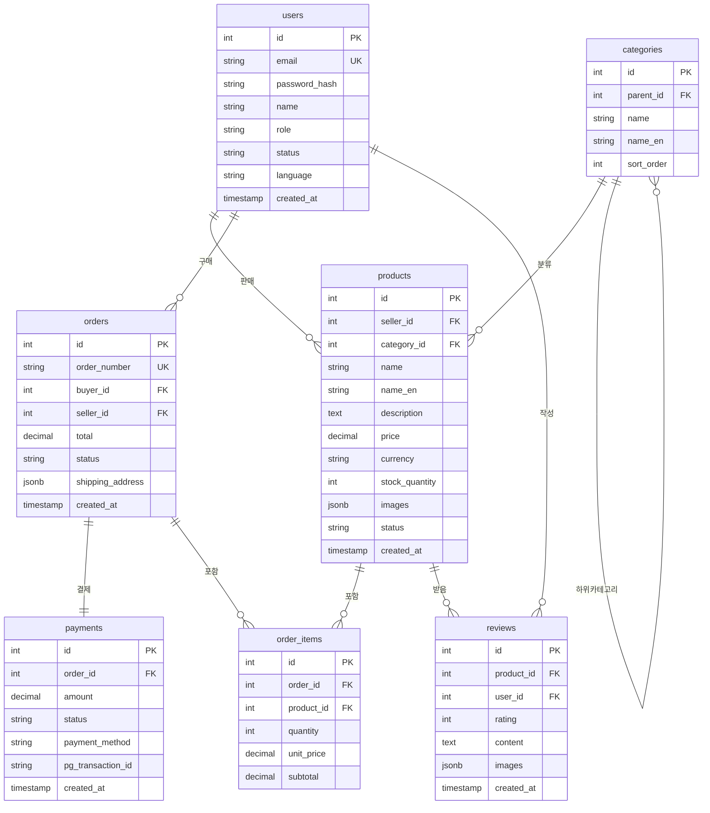

# 데이터베이스 설계서 (Phase 1 MVP)

## 문서 정보
- 작성일: 2025-11-19
- 버전: 1.0 (Phase 1 MVP)
- DBMS: PostgreSQL 15+
- 목적: 실제 구현 가능한 최소 데이터베이스 구조

---

## 1. 설계 개요

### 1.1 설계 원칙
- **최소화**: Phase 1에 필요한 핵심 테이블만 (7개)
- **단순화**: 복잡한 관계 최소화
- **확장성**: Phase 2-3 확장 가능한 구조
- **표준화**: 네이밍 규칙 일관성

### 1.2 테이블 목록

| # | 테이블명 | 용도 | 우선순위 |
|---|---------|------|---------|
| 1 | users | 회원 정보 | 필수 |
| 2 | categories | 상품 카테고리 | 필수 |
| 3 | products | 상품 정보 | 필수 |
| 4 | orders | 주문 정보 | 필수 |
| 5 | order_items | 주문 항목 | 필수 |
| 6 | payments | 결제 정보 | 필수 |
| 7 | reviews | 리뷰 | 필수 |

---

## 2. ERD (Entity Relationship Diagram)



---

## 3. 테이블 상세 설계

### 3.1 users (회원)

```sql
CREATE TABLE users (
    -- 기본키
    id SERIAL PRIMARY KEY,
    
    -- 인증 정보
    email VARCHAR(255) UNIQUE NOT NULL,
    password_hash VARCHAR(255), -- OAuth의 경우 NULL 가능
    
    -- 기본 정보
    name VARCHAR(200) NOT NULL,
    phone VARCHAR(20),
    
    -- 역할 및 상태
    role VARCHAR(20) NOT NULL DEFAULT 'buyer',
    -- buyer: 구매자, seller: 판매자, admin: 관리자
    status VARCHAR(20) NOT NULL DEFAULT 'active',
    -- active: 활성, inactive: 비활성, suspended: 정지
    
    -- 다국어 설정
    language VARCHAR(10) NOT NULL DEFAULT 'ko',
    -- ko: 한국어, en: 영어
    
    -- 타임스탬프
    created_at TIMESTAMP NOT NULL DEFAULT NOW(),
    updated_at TIMESTAMP NOT NULL DEFAULT NOW(),
    last_login_at TIMESTAMP
);

-- 인덱스
CREATE INDEX idx_users_email ON users(email);
CREATE INDEX idx_users_role ON users(role);
CREATE INDEX idx_users_status ON users(status);

-- 제약조건
ALTER TABLE users ADD CONSTRAINT check_role 
    CHECK (role IN ('buyer', 'seller', 'admin'));

ALTER TABLE users ADD CONSTRAINT check_status 
    CHECK (status IN ('active', 'inactive', 'suspended'));

ALTER TABLE users ADD CONSTRAINT check_language 
    CHECK (language IN ('ko', 'en'));

-- 트리거 (updated_at 자동 갱신)
CREATE OR REPLACE FUNCTION update_updated_at_column()
RETURNS TRIGGER AS $$
BEGIN
    NEW.updated_at = NOW();
    RETURN NEW;
END;
$$ LANGUAGE plpgsql;

CREATE TRIGGER update_users_updated_at 
    BEFORE UPDATE ON users
    FOR EACH ROW 
    EXECUTE FUNCTION update_updated_at_column();
```

**필드 설명:**
- `id`: 고유 식별자 (자동 증가)
- `email`: 이메일 (로그인 ID, 중복 불가)
- `password_hash`: 비밀번호 해시 (bcrypt)
- `name`: 사용자 이름
- `role`: 역할 (구매자/판매자/관리자)
- `status`: 계정 상태
- `language`: 기본 언어 설정

---

### 3.2 categories (카테고리)

```sql
CREATE TABLE categories (
    -- 기본키
    id SERIAL PRIMARY KEY,
    
    -- 계층 구조
    parent_id INTEGER REFERENCES categories(id) ON DELETE CASCADE,
    
    -- 카테고리명
    name VARCHAR(200) NOT NULL,
    name_en VARCHAR(200), -- 영문명
    
    -- 정렬 순서
    sort_order INTEGER NOT NULL DEFAULT 0,
    
    -- 타임스탬프
    created_at TIMESTAMP NOT NULL DEFAULT NOW()
);

-- 인덱스
CREATE INDEX idx_categories_parent_id ON categories(parent_id);
CREATE INDEX idx_categories_sort_order ON categories(sort_order);

-- 샘플 데이터
INSERT INTO categories (id, parent_id, name, name_en, sort_order) VALUES
(1, NULL, '김치/반찬', 'Kimchi & Side Dishes', 1),
(2, NULL, '장류/양념', 'Sauces & Seasonings', 2),
(3, NULL, '면류', 'Noodles', 3),
(4, NULL, '과자/간식', 'Snacks', 4),
(5, 1, '배추김치', 'Cabbage Kimchi', 1),
(6, 1, '깍두기', 'Radish Kimchi', 2),
(7, 2, '고추장', 'Gochujang', 1),
(8, 2, '된장', 'Doenjang', 2),
(9, 3, '라면', 'Instant Noodles', 1),
(10, 3, '냉면', 'Cold Noodles', 2);
```

**필드 설명:**
- `parent_id`: 상위 카테고리 (NULL이면 최상위)
- `name`: 한글 카테고리명
- `name_en`: 영문 카테고리명
- `sort_order`: 표시 순서

---

### 3.3 products (상품)

```sql
CREATE TABLE products (
    -- 기본키
    id SERIAL PRIMARY KEY,
    
    -- 관계
    seller_id INTEGER NOT NULL REFERENCES users(id) ON DELETE CASCADE,
    category_id INTEGER REFERENCES categories(id) ON DELETE SET NULL,
    
    -- 상품 정보 (다국어)
    name VARCHAR(500) NOT NULL,
    name_en VARCHAR(500),
    description TEXT,
    description_en TEXT,
    
    -- 가격 및 재고
    price DECIMAL(15, 2) NOT NULL CHECK (price >= 0),
    currency VARCHAR(3) NOT NULL DEFAULT 'USD',
    stock_quantity INTEGER NOT NULL DEFAULT 0 CHECK (stock_quantity >= 0),
    
    -- 이미지 (JSON 배열)
    images JSONB,
    -- 예: ["https://s3.../image1.jpg", "https://s3.../image2.jpg"]
    
    -- 상태
    status VARCHAR(20) NOT NULL DEFAULT 'draft',
    -- draft: 임시저장, published: 판매중, soldout: 품절, discontinued: 단종
    
    -- 통계
    view_count INTEGER NOT NULL DEFAULT 0,
    rating_average DECIMAL(3, 2) DEFAULT 0,
    review_count INTEGER NOT NULL DEFAULT 0,
    
    -- 타임스탬프
    created_at TIMESTAMP NOT NULL DEFAULT NOW(),
    updated_at TIMESTAMP NOT NULL DEFAULT NOW()
);

-- 인덱스
CREATE INDEX idx_products_seller_id ON products(seller_id);
CREATE INDEX idx_products_category_id ON products(category_id);
CREATE INDEX idx_products_status ON products(status);
CREATE INDEX idx_products_created_at ON products(created_at DESC);
CREATE INDEX idx_products_rating ON products(rating_average DESC);

-- 제약조건
ALTER TABLE products ADD CONSTRAINT check_status 
    CHECK (status IN ('draft', 'published', 'soldout', 'discontinued'));

ALTER TABLE products ADD CONSTRAINT check_currency 
    CHECK (currency IN ('USD', 'KRW', 'EUR', 'JPY', 'CNY'));

-- 트리거 (updated_at)
CREATE TRIGGER update_products_updated_at 
    BEFORE UPDATE ON products
    FOR EACH ROW 
    EXECUTE FUNCTION update_updated_at_column();

-- 전문 검색 인덱스 (상품명)
CREATE INDEX idx_products_name_search ON products 
    USING gin(to_tsvector('english', name));
```

**필드 설명:**
- `seller_id`: 판매자 ID
- `name/name_en`: 상품명 (한글/영문)
- `price`: 가격
- `currency`: 통화 (USD 기본)
- `stock_quantity`: 재고 수량
- `images`: 이미지 URL 배열 (JSON)
- `status`: 판매 상태

---

### 3.4 orders (주문)

```sql
CREATE TABLE orders (
    -- 기본키
    id SERIAL PRIMARY KEY,
    
    -- 주문번호 (표시용)
    order_number VARCHAR(50) UNIQUE NOT NULL,
    -- 예: ORD-20251119-0001
    
    -- 관계
    buyer_id INTEGER NOT NULL REFERENCES users(id) ON DELETE RESTRICT,
    seller_id INTEGER NOT NULL REFERENCES users(id) ON DELETE RESTRICT,
    
    -- 금액
    subtotal DECIMAL(15, 2) NOT NULL CHECK (subtotal >= 0),
    shipping_fee DECIMAL(15, 2) NOT NULL DEFAULT 0,
    total DECIMAL(15, 2) NOT NULL CHECK (total >= 0),
    currency VARCHAR(3) NOT NULL DEFAULT 'USD',
    
    -- 배송 정보 (JSON)
    shipping_address JSONB NOT NULL,
    /* 예시:
    {
        "name": "홍길동",
        "phone": "010-1234-5678",
        "address": "서울시 강남구...",
        "zipcode": "06000"
    }
    */
    
    -- 주문 상태
    status VARCHAR(50) NOT NULL DEFAULT 'pending',
    -- pending: 대기, confirmed: 확인, preparing: 준비중,
    -- shipped: 배송중, delivered: 완료, cancelled: 취소
    
    -- 메모
    buyer_note TEXT,
    
    -- 타임스탬프
    created_at TIMESTAMP NOT NULL DEFAULT NOW(),
    updated_at TIMESTAMP NOT NULL DEFAULT NOW(),
    confirmed_at TIMESTAMP,
    shipped_at TIMESTAMP,
    delivered_at TIMESTAMP,
    cancelled_at TIMESTAMP
);

-- 인덱스
CREATE INDEX idx_orders_order_number ON orders(order_number);
CREATE INDEX idx_orders_buyer_id ON orders(buyer_id);
CREATE INDEX idx_orders_seller_id ON orders(seller_id);
CREATE INDEX idx_orders_status ON orders(status);
CREATE INDEX idx_orders_created_at ON orders(created_at DESC);

-- 제약조건
ALTER TABLE orders ADD CONSTRAINT check_order_status 
    CHECK (status IN ('pending', 'confirmed', 'preparing', 'shipped', 'delivered', 'cancelled'));

-- 트리거 (updated_at)
CREATE TRIGGER update_orders_updated_at 
    BEFORE UPDATE ON orders
    FOR EACH ROW 
    EXECUTE FUNCTION update_updated_at_column();

-- 주문번호 생성 함수
CREATE OR REPLACE FUNCTION generate_order_number()
RETURNS TEXT AS $$
DECLARE
    new_number TEXT;
    counter INTEGER;
BEGIN
    SELECT COUNT(*) + 1 INTO counter 
    FROM orders 
    WHERE DATE(created_at) = CURRENT_DATE;
    
    new_number := 'ORD-' || TO_CHAR(CURRENT_DATE, 'YYYYMMDD') || '-' || LPAD(counter::TEXT, 4, '0');
    
    RETURN new_number;
END;
$$ LANGUAGE plpgsql;
```

**필드 설명:**
- `order_number`: 주문번호 (사용자에게 표시)
- `buyer_id`: 구매자 ID
- `seller_id`: 판매자 ID
- `total`: 총 주문 금액
- `shipping_address`: 배송지 정보 (JSON)
- `status`: 주문 상태

---

### 3.5 order_items (주문 항목)

```sql
CREATE TABLE order_items (
    -- 기본키
    id SERIAL PRIMARY KEY,
    
    -- 관계
    order_id INTEGER NOT NULL REFERENCES orders(id) ON DELETE CASCADE,
    product_id INTEGER NOT NULL REFERENCES products(id) ON DELETE RESTRICT,
    
    -- 주문 시점 상품 정보 (스냅샷)
    product_name VARCHAR(500) NOT NULL,
    product_name_en VARCHAR(500),
    
    -- 수량 및 가격
    quantity INTEGER NOT NULL CHECK (quantity > 0),
    unit_price DECIMAL(15, 2) NOT NULL CHECK (unit_price >= 0),
    subtotal DECIMAL(15, 2) NOT NULL CHECK (subtotal >= 0),
    
    -- 타임스탬프
    created_at TIMESTAMP NOT NULL DEFAULT NOW()
);

-- 인덱스
CREATE INDEX idx_order_items_order_id ON order_items(order_id);
CREATE INDEX idx_order_items_product_id ON order_items(product_id);

-- 재고 감소 트리거
CREATE OR REPLACE FUNCTION decrease_product_stock()
RETURNS TRIGGER AS $$
BEGIN
    UPDATE products 
    SET stock_quantity = stock_quantity - NEW.quantity
    WHERE id = NEW.product_id;
    
    RETURN NEW;
END;
$$ LANGUAGE plpgsql;

CREATE TRIGGER trigger_decrease_stock 
    AFTER INSERT ON order_items
    FOR EACH ROW 
    EXECUTE FUNCTION decrease_product_stock();
```

**필드 설명:**
- `order_id`: 주문 ID
- `product_id`: 상품 ID
- `product_name`: 주문 시점의 상품명 (스냅샷)
- `quantity`: 수량
- `unit_price`: 단가
- `subtotal`: 소계 (quantity × unit_price)

---

### 3.6 payments (결제)

```sql
CREATE TABLE payments (
    -- 기본키
    id SERIAL PRIMARY KEY,
    
    -- 관계
    order_id INTEGER NOT NULL REFERENCES orders(id) ON DELETE RESTRICT,
    
    -- 결제 금액
    amount DECIMAL(15, 2) NOT NULL CHECK (amount >= 0),
    currency VARCHAR(3) NOT NULL DEFAULT 'USD',
    
    -- 결제 방법
    payment_method VARCHAR(50) NOT NULL,
    -- card: 카드, bank_transfer: 계좌이체, paypal: 페이팔, stripe: 스트라이프
    
    -- 결제 상태
    status VARCHAR(50) NOT NULL DEFAULT 'pending',
    -- pending: 대기, completed: 완료, failed: 실패, cancelled: 취소, refunded: 환불
    
    -- PG사 정보
    pg_provider VARCHAR(50), -- stripe, paypal, tosspayments
    pg_transaction_id VARCHAR(255), -- PG사 거래 ID
    pg_response JSONB, -- PG사 응답 전체 (디버깅용)
    
    -- 타임스탬프
    created_at TIMESTAMP NOT NULL DEFAULT NOW(),
    paid_at TIMESTAMP,
    refunded_at TIMESTAMP
);

-- 인덱스
CREATE INDEX idx_payments_order_id ON payments(order_id);
CREATE INDEX idx_payments_status ON payments(status);
CREATE INDEX idx_payments_pg_transaction_id ON payments(pg_transaction_id);

-- 제약조건
ALTER TABLE payments ADD CONSTRAINT check_payment_status 
    CHECK (status IN ('pending', 'completed', 'failed', 'cancelled', 'refunded'));

ALTER TABLE payments ADD CONSTRAINT check_payment_method 
    CHECK (payment_method IN ('card', 'bank_transfer', 'paypal', 'stripe'));
```

**필드 설명:**
- `order_id`: 주문 ID
- `amount`: 결제 금액
- `payment_method`: 결제 수단
- `status`: 결제 상태
- `pg_transaction_id`: PG사 거래 ID

---

### 3.7 reviews (리뷰)

```sql
CREATE TABLE reviews (
    -- 기본키
    id SERIAL PRIMARY KEY,
    
    -- 관계
    product_id INTEGER NOT NULL REFERENCES products(id) ON DELETE CASCADE,
    user_id INTEGER NOT NULL REFERENCES users(id) ON DELETE CASCADE,
    
    -- 평점
    rating INTEGER NOT NULL CHECK (rating >= 1 AND rating <= 5),
    
    -- 리뷰 내용
    title VARCHAR(200),
    content TEXT NOT NULL,
    
    -- 이미지 (JSON 배열)
    images JSONB,
    
    -- 구매 인증 여부
    is_verified_purchase BOOLEAN DEFAULT FALSE,
    
    -- 상태
    status VARCHAR(20) NOT NULL DEFAULT 'published',
    -- published: 게시, hidden: 숨김, deleted: 삭제
    
    -- 타임스탬프
    created_at TIMESTAMP NOT NULL DEFAULT NOW(),
    updated_at TIMESTAMP NOT NULL DEFAULT NOW()
);

-- 인덱스
CREATE INDEX idx_reviews_product_id ON reviews(product_id);
CREATE INDEX idx_reviews_user_id ON reviews(user_id);
CREATE INDEX idx_reviews_rating ON reviews(rating);
CREATE INDEX idx_reviews_created_at ON reviews(created_at DESC);

-- 제약조건
ALTER TABLE reviews ADD CONSTRAINT check_review_status 
    CHECK (status IN ('published', 'hidden', 'deleted'));

-- 중복 리뷰 방지 (사용자당 상품 1개)
CREATE UNIQUE INDEX idx_reviews_unique ON reviews(product_id, user_id) 
    WHERE status = 'published';

-- 상품 평점 업데이트 트리거
CREATE OR REPLACE FUNCTION update_product_rating()
RETURNS TRIGGER AS $$
BEGIN
    UPDATE products
    SET 
        rating_average = (
            SELECT COALESCE(AVG(rating)::DECIMAL(3,2), 0)
            FROM reviews
            WHERE product_id = NEW.product_id AND status = 'published'
        ),
        review_count = (
            SELECT COUNT(*)
            FROM reviews
            WHERE product_id = NEW.product_id AND status = 'published'
        )
    WHERE id = NEW.product_id;
    
    RETURN NEW;
END;
$$ LANGUAGE plpgsql;

CREATE TRIGGER trigger_update_rating 
    AFTER INSERT OR UPDATE ON reviews
    FOR EACH ROW 
    EXECUTE FUNCTION update_product_rating();

-- 트리거 (updated_at)
CREATE TRIGGER update_reviews_updated_at 
    BEFORE UPDATE ON reviews
    FOR EACH ROW 
    EXECUTE FUNCTION update_updated_at_column();
```

**필드 설명:**
- `product_id`: 상품 ID
- `user_id`: 작성자 ID
- `rating`: 평점 (1-5)
- `content`: 리뷰 내용
- `images`: 첨부 이미지 (JSON)
- `is_verified_purchase`: 구매 인증 여부

---

## 4. 관계 정의

### 4.1 주요 관계

```
users (1) ─────< (N) products
    판매자는 여러 상품을 등록할 수 있음

users (1) ─────< (N) orders
    구매자는 여러 주문을 할 수 있음

products (1) ───< (N) order_items
    상품은 여러 주문에 포함될 수 있음

orders (1) ─────< (N) order_items
    주문은 여러 상품을 포함할 수 있음

orders (1) ─────(1) payments
    주문은 하나의 결제를 가짐

products (1) ───< (N) reviews
    상품은 여러 리뷰를 받을 수 있음

categories (1) ─< (N) categories
    카테고리는 하위 카테고리를 가질 수 있음
```

---

## 5. 인덱스 전략

### 5.1 성능 최적화 인덱스

```sql
-- 검색 성능
CREATE INDEX idx_products_name_search ON products 
    USING gin(to_tsvector('english', name));

-- 정렬 성능
CREATE INDEX idx_products_price ON products(price);
CREATE INDEX idx_products_created_at ON products(created_at DESC);
CREATE INDEX idx_products_rating ON products(rating_average DESC);

-- 필터링 성능
CREATE INDEX idx_products_status_category ON products(status, category_id);
CREATE INDEX idx_orders_status_buyer ON orders(status, buyer_id);
```

### 5.2 인덱스 사용 가이드

**좋은 인덱스 후보:**
- WHERE 절에 자주 사용되는 컬럼
- JOIN에 사용되는 Foreign Key
- ORDER BY에 사용되는 컬럼
- 카디널리티가 높은 컬럼

**인덱스가 불필요한 경우:**
- 테이블이 작은 경우 (< 1000 rows)
- 자주 UPDATE되는 컬럼
- 카디널리티가 낮은 컬럼 (예: boolean)

---

## 6. 초기 데이터 (Seed Data)

### 6.1 관리자 계정

```sql
-- 비밀번호: admin123 (bcrypt 해시)
INSERT INTO users (email, password_hash, name, role, status, language) VALUES
('admin@spicyjump.com', '$2b$12$...', 'Admin', 'admin', 'active', 'en');
```

### 6.2 카테고리 (이미 위에 포함)

### 6.3 샘플 상품 (개발/테스트용)

```sql
-- 판매자 계정
INSERT INTO users (email, password_hash, name, role) VALUES
('seller@example.com', '$2b$12$...', 'Test Seller', 'seller');

-- 샘플 상품
INSERT INTO products (seller_id, category_id, name, name_en, description, price, currency, stock_quantity, images, status) VALUES
(2, 5, '배추김치 1kg', 'Cabbage Kimchi 1kg', '정성껏 담근 배추김치', 15.00, 'USD', 100, '["https://..."]', 'published'),
(2, 7, '태양초 고추장 500g', 'Gochujang 500g', '전통 방식 고추장', 12.00, 'USD', 50, '["https://..."]', 'published'),
(2, 9, '신라면 5개입', 'Shin Ramyun 5pack', '매운맛 라면', 8.00, 'USD', 200, '["https://..."]', 'published');
```

---

## 7. 백업 및 복구

### 7.1 백업 전략

```bash
# 일일 백업 스크립트
#!/bin/bash
DATE=$(date +%Y%m%d_%H%M%S)
pg_dump -U postgres -d spicyjump_mvp -F c -f backup_${DATE}.dump

# 7일 이상 된 백업 삭제
find /backups -name "backup_*.dump" -mtime +7 -delete
```

### 7.2 복구

```bash
# 전체 복구
pg_restore -U postgres -d spicyjump_mvp -c backup_YYYYMMDD_HHMMSS.dump

# 특정 테이블만 복구
pg_restore -U postgres -d spicyjump_mvp -t products backup_YYYYMMDD_HHMMSS.dump
```

---

## 8. Phase 2 확장 준비

### 8.1 추가 예정 테이블

```sql
-- Phase 2에서 추가할 테이블들
-- comments (댓글)
-- reward_points (포인트)
-- blockchain_transactions (블록체인)
-- product_origin (원산지)
-- product_haccp (HACCP)
-- notifications (알림)
-- admin_logs (관리자 로그)
```

### 8.2 마이그레이션 전략

- Alembic 사용 (Python)
- 버전 관리
- 롤백 가능한 스크립트

---

## 부록

### A. 데이터베이스 생성

```sql
-- 데이터베이스 생성
CREATE DATABASE spicyjump_mvp
    WITH 
    ENCODING = 'UTF8'
    LC_COLLATE = 'en_US.UTF-8'
    LC_CTYPE = 'en_US.UTF-8'
    TEMPLATE = template0;

-- 확장 기능
CREATE EXTENSION IF NOT EXISTS "uuid-ossp";
CREATE EXTENSION IF NOT EXISTS "pg_trgm"; -- 유사 검색용
```

### B. 성능 튜닝

```sql
-- 통계 업데이트
ANALYZE;

-- 인덱스 재구축
REINDEX DATABASE spicyjump_mvp;

-- 쿼리 성능 확인
EXPLAIN ANALYZE SELECT * FROM products WHERE status = 'published';
```

---

**문서 관리**
- 작성자: 장재훈
- 최종 업데이트: 2025-11-19
- 다음 리뷰: Phase 1 구현 완료 시


