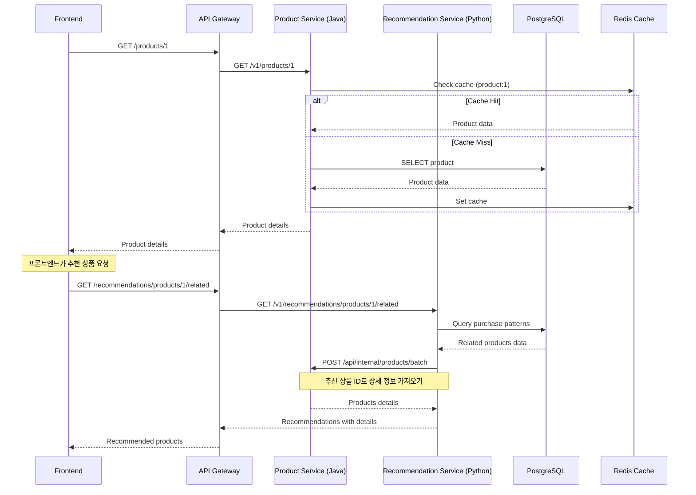
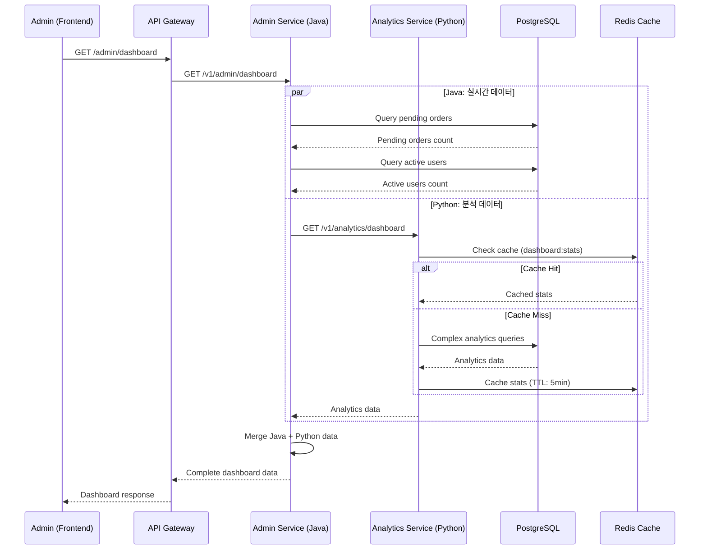
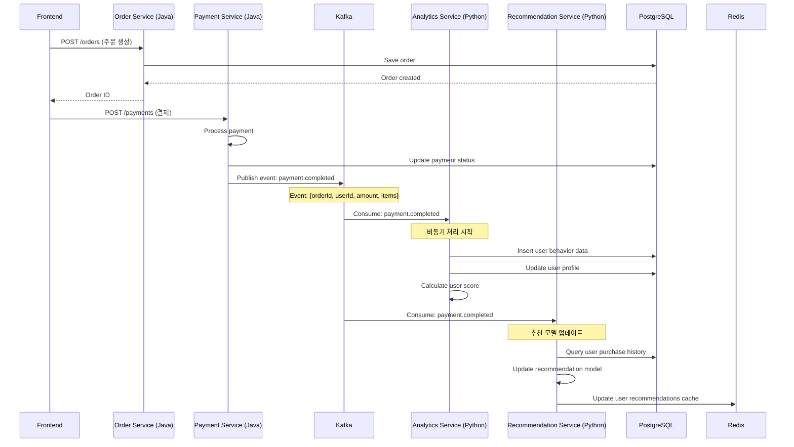
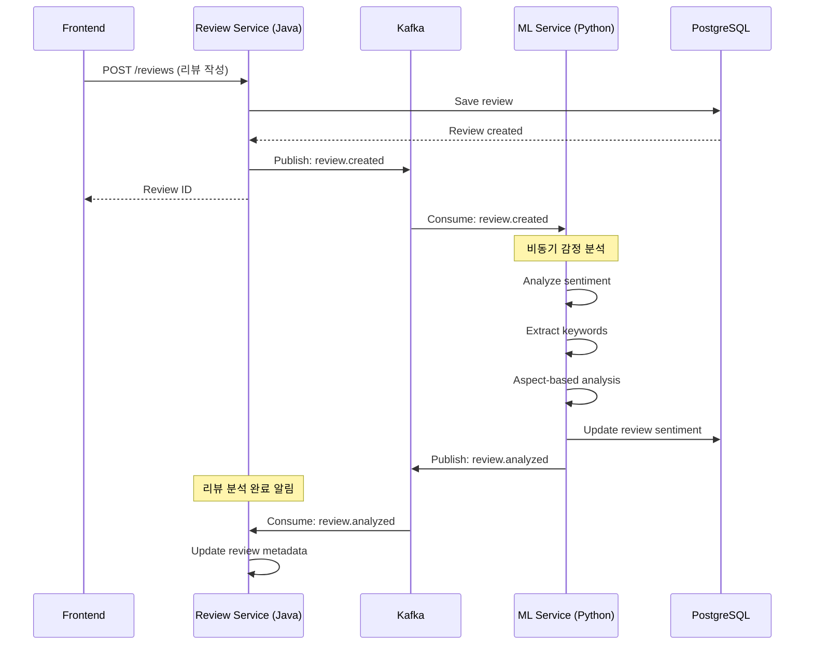
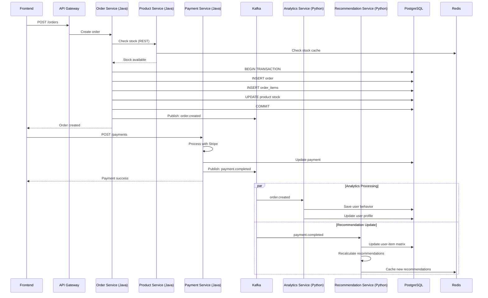

# 서비스 간 통신 시퀀스 다이어그램
# Java ↔ Python 서비스 통신 패턴

**문서 버전**: v1.0  
**작성일**: 2025-11-20  
**프로젝트**: K-Food 거래 플랫폼 (XLCfi)

---

## 목차

1. [통신 개요](#1-통신-개요)
2. [동기 통신 시나리오](#2-동기-통신-시나리오)
3. [비동기 통신 시나리오](#3-비동기-통신-시나리오)
4. [복합 시나리오](#4-복합-시나리오)
5. [에러 처리 패턴](#5-에러-처리-패턴)

---

## 1. 통신 개요

### 1.1 통신 방식

```
┌─────────────────────────────────────────────────────────────┐
│                       통신 방식                              │
├─────────────────────────────────────────────────────────────┤
│                                                               │
│  동기 통신 (REST API)                                         │
│  ├── Java → Python: RestTemplate / WebClient                │
│  ├── Python → Java: requests 라이브러리                      │
│  └── 용도: 즉시 응답 필요, 실시간 데이터                      │
│                                                               │
│  비동기 통신 (Kafka)                                          │
│  ├── 이벤트 발행: Java → Kafka                               │
│  ├── 이벤트 구독: Kafka → Python                             │
│  └── 용도: 비즈니스 이벤트, 데이터 분석, 로그                 │
│                                                               │
│  데이터 공유 (PostgreSQL)                                     │
│  ├── 읽기: 모든 서비스                                        │
│  ├── 쓰기: 주로 Java (트랜잭션)                              │
│  └── 용도: 영구 데이터 저장                                   │
│                                                               │
│  캐시 공유 (Redis)                                            │
│  ├── 읽기/쓰기: 모든 서비스                                   │
│  └── 용도: 세션, 캐시, Rate Limiting                         │
│                                                               │
└─────────────────────────────────────────────────────────────┘
```

### 1.2 서비스 맵

```
                          ┌──────────────┐
                          │   Frontend   │
                          │   (Next.js)  │
                          └──────┬───────┘
                                 │
                                 ▼
                       ┌─────────────────┐
                       │  API Gateway    │
                       │  (Spring Cloud) │
                       └────────┬────────┘
                                │
                 ┌──────────────┴──────────────┐
                 ▼                             ▼
        ┌─────────────────┐         ┌─────────────────┐
        │  Java Services  │◄───────►│Python Services  │
        │                 │  REST   │                 │
        │ - Auth          │         │ - Analytics     │
        │ - Product       │         │ - Recommendation│
        │ - Order         │         │ - ML            │
        │ - Payment       │         │ - Image         │
        │ - Review        │         │ - Report        │
        │ - Blockchain    │         │ - ETL           │
        └────────┬────────┘         └────────┬────────┘
                 │                           │
                 └──────────┬────────────────┘
                            ▼
                    ┌───────────────┐
                    │     Kafka     │
                    │ (Event Bus)   │
                    └───────────────┘
                            │
                 ┌──────────┴──────────┐
                 ▼                     ▼
        ┌─────────────────┐   ┌─────────────────┐
        │  PostgreSQL     │   │     Redis       │
        │  (Shared DB)    │   │   (Cache)       │
        └─────────────────┘   └─────────────────┘
```

---

## 2. 동기 통신 시나리오

### 2.1 시나리오: 상품 페이지 로드 (추천 포함)

**목적**: 사용자가 상품 상세 페이지를 볼 때 추천 상품도 함께 표시



#### Java Code (Product Service)
```java
@RestController
@RequestMapping("/v1/products")
@RequiredArgsConstructor
public class ProductController {
    
    private final ProductService productService;
    private final CacheManager cacheManager;
    
    @GetMapping("/{productId}")
    public ResponseEntity<ApiResponse<ProductDetailResponse>> getProduct(
        @PathVariable Long productId
    ) {
        ProductDetailResponse product = productService.getProduct(productId);
        return ResponseEntity.ok(ApiResponse.success(product));
    }
    
    @PostMapping("/api/internal/products/batch")
    @PreAuthorize("hasRole('INTERNAL_SERVICE')")
    public ResponseEntity<ApiResponse<ProductBatchResponse>> getProductsBatch(
        @Valid @RequestBody ProductBatchRequest request
    ) {
        List<ProductResponse> products = productService.getProductsBatch(
            request.getProductIds()
        );
        return ResponseEntity.ok(ApiResponse.success(
            new ProductBatchResponse(products)
        ));
    }
}

@Service
@Transactional(readOnly = true)
public class ProductService {
    
    @Cacheable(value = "products", key = "#productId")
    public ProductDetailResponse getProduct(Long productId) {
        Product product = productRepository.findByIdWithDetails(productId)
            .orElseThrow(() -> new ProductNotFoundException(productId));
        
        // 조회수 증가 (비동기)
        eventPublisher.publishProductViewed(productId);
        
        return ProductDetailResponse.from(product);
    }
    
    public List<ProductResponse> getProductsBatch(List<Long> productIds) {
        List<Product> products = productRepository.findAllByIdIn(productIds);
        return products.stream()
            .map(ProductResponse::from)
            .collect(Collectors.toList());
    }
}
```

#### Python Code (Recommendation Service)
```python
import requests
from typing import List, Dict
import logging

logger = logging.getLogger(__name__)

JAVA_PRODUCT_SERVICE_URL = "http://product-service:8082"

@app.route('/v1/recommendations/products/<int:product_id>/related', methods=['GET'])
@require_internal_auth
def get_related_products(product_id: int):
    """연관 상품 추천"""
    limit = int(request.args.get('limit', 5))
    
    # 1. 구매 패턴 분석 (PostgreSQL)
    related_product_ids = find_related_products(product_id, limit)
    
    if not related_product_ids:
        return success_response({'related_products': []})
    
    # 2. Java Product Service에서 상품 상세 정보 가져오기
    product_details = fetch_products_from_java(related_product_ids)
    
    # 3. 추천 점수와 상세 정보 결합
    recommendations = []
    for product_id, score in related_product_ids.items():
        product = product_details.get(product_id)
        if product:
            recommendations.append({
                'product_id': product_id,
                'score': score,
                'product': product
            })
    
    return success_response({
        'product_id': product_id,
        'related_products': recommendations
    })

def find_related_products(product_id: int, limit: int) -> Dict[int, float]:
    """구매 패턴 기반 연관 상품 찾기"""
    query = text("""
        WITH product_orders AS (
            SELECT DISTINCT order_id
            FROM order_items
            WHERE product_id = :product_id
        )
        SELECT 
            oi.product_id,
            COUNT(*) as co_purchase_count,
            COUNT(*) * 1.0 / (
                SELECT COUNT(DISTINCT order_id) FROM product_orders
            ) as score
        FROM order_items oi
        WHERE oi.order_id IN (SELECT order_id FROM product_orders)
        AND oi.product_id != :product_id
        GROUP BY oi.product_id
        ORDER BY score DESC
        LIMIT :limit
    """)
    
    with engine.connect() as conn:
        results = conn.execute(query, {
            'product_id': product_id,
            'limit': limit
        }).fetchall()
    
    return {
        row.product_id: round(float(row.score), 2)
        for row in results
    }

def fetch_products_from_java(product_ids: List[int]) -> Dict[int, dict]:
    """Java Product Service에서 상품 정보 가져오기"""
    url = f"{JAVA_PRODUCT_SERVICE_URL}/api/internal/products/batch"
    
    headers = {
        'X-Internal-Token': generate_internal_token(),
        'Content-Type': 'application/json'
    }
    
    try:
        response = requests.post(
            url,
            json={'product_ids': product_ids},
            headers=headers,
            timeout=5
        )
        response.raise_for_status()
        
        data = response.json().get('data', {})
        products = data.get('products', [])
        
        return {p['id']: p for p in products}
    
    except requests.exceptions.Timeout:
        logger.error(f"Timeout fetching products from Java service")
        return {}
    except requests.exceptions.RequestException as e:
        logger.error(f"Failed to fetch products: {e}")
        return {}
```

---

### 2.2 시나리오: 관리자 대시보드 로드

**목적**: 관리자가 대시보드를 볼 때 실시간 통계와 분석 데이터 결합



#### Java Code (Admin Service)
```java
@RestController
@RequestMapping("/v1/admin")
@RequiredArgsConstructor
@PreAuthorize("hasRole('ADMIN')")
public class AdminDashboardController {
    
    private final AdminService adminService;
    private final PythonAnalyticsClient analyticsClient;
    
    @GetMapping("/dashboard")
    public ResponseEntity<ApiResponse<DashboardResponse>> getDashboard(
        @RequestParam(defaultValue = "month") String period
    ) {
        // 1. Java에서 실시간 데이터 조회
        DashboardResponse dashboard = adminService.getRealTimeStats();
        
        // 2. Python에서 분석 데이터 조회 (비동기로 처리 가능)
        try {
            AnalyticsData analytics = analyticsClient.getDashboardAnalytics(period);
            dashboard.setAnalytics(analytics);
        } catch (Exception e) {
            log.error("Failed to fetch analytics data: {}", e.getMessage());
            // 분석 데이터 없이도 대시보드 표시 (Fallback)
            dashboard.setAnalytics(AnalyticsData.empty());
        }
        
        return ResponseEntity.ok(ApiResponse.success(dashboard));
    }
}

@Service
@RequiredArgsConstructor
public class AdminService {
    
    private final OrderRepository orderRepository;
    private final UserRepository userRepository;
    private final ProductRepository productRepository;
    
    public DashboardResponse getRealTimeStats() {
        return DashboardResponse.builder()
            .pendingOrders(orderRepository.countByStatus(OrderStatus.PENDING))
            .activeUsersToday(userRepository.countActiveToday())
            .totalProducts(productRepository.count())
            .build();
    }
}

@Component
@RequiredArgsConstructor
public class PythonAnalyticsClient {
    
    private final RestTemplate restTemplate;
    
    @Value("${python.analytics.url}")
    private String analyticsServiceUrl;
    
    @CircuitBreaker(name = "analyticsService", fallbackMethod = "getAnalyticsFallback")
    @Retry(name = "analyticsService")
    public AnalyticsData getDashboardAnalytics(String period) {
        String url = analyticsServiceUrl + "/v1/analytics/dashboard?period=" + period;
        
        HttpHeaders headers = new HttpHeaders();
        headers.set("X-Internal-Token", generateInternalToken());
        
        HttpEntity<?> entity = new HttpEntity<>(headers);
        
        ResponseEntity<PythonApiResponse<AnalyticsData>> response = restTemplate.exchange(
            url,
            HttpMethod.GET,
            entity,
            new ParameterizedTypeReference<PythonApiResponse<AnalyticsData>>() {}
        );
        
        if (response.getBody() != null && response.getBody().isSuccess()) {
            return response.getBody().getData();
        }
        
        throw new AnalyticsServiceException("Failed to fetch analytics data");
    }
    
    public AnalyticsData getAnalyticsFallback(String period, Exception e) {
        log.warn("Analytics service fallback triggered: {}", e.getMessage());
        return AnalyticsData.empty();
    }
}
```

#### Python Code (Analytics Service)
```python
from flask import Flask, request
from functools import lru_cache
import redis

redis_client = redis.Redis(host='redis', port=6379, decode_responses=True)

@app.route('/v1/analytics/dashboard', methods=['GET'])
@require_internal_auth
def get_dashboard_analytics():
    """대시보드 분석 데이터"""
    period = request.args.get('period', 'month')
    
    # 캐시 키
    cache_key = f"dashboard:stats:{period}"
    
    # Redis 캐시 확인
    cached_data = redis_client.get(cache_key)
    if cached_data:
        logger.info(f"Cache hit for {cache_key}")
        return success_response(json.loads(cached_data))
    
    # 캐시 미스 - 데이터 계산
    logger.info(f"Cache miss for {cache_key} - computing analytics")
    
    start_date, end_date = get_date_range(period)
    
    # 복잡한 분석 쿼리 실행
    analytics_data = {
        'revenue': calculate_revenue_stats(start_date, end_date),
        'orders': calculate_order_stats(start_date, end_date),
        'users': calculate_user_stats(start_date, end_date),
        'daily_trend': calculate_daily_trend(start_date, end_date),
        'top_products': get_top_products(start_date, end_date, limit=10),
        'top_categories': get_top_categories(start_date, end_date, limit=5)
    }
    
    # Redis 캐시 저장 (5분 TTL)
    redis_client.setex(
        cache_key,
        300,  # 5분
        json.dumps(analytics_data)
    )
    
    return success_response(analytics_data)
```

---

## 3. 비동기 통신 시나리오

### 3.1 시나리오: 주문 완료 후 데이터 분석

**목적**: 주문이 완료되면 분석 서비스에서 사용자 행동 패턴 업데이트



#### Java Code (Payment Service)
```java
@Service
@RequiredArgsConstructor
@Transactional
public class PaymentService {
    
    private final PaymentRepository paymentRepository;
    private final OrderRepository orderRepository;
    private final KafkaTemplate<String, PaymentEvent> kafkaTemplate;
    
    public void completePayment(String transactionId) {
        Payment payment = paymentRepository.findByPgTransactionId(transactionId)
            .orElseThrow(() -> new PaymentNotFoundException(transactionId));
        
        // 결제 상태 업데이트
        payment.updateStatus(PaymentStatus.COMPLETED);
        payment.setPaidAt(LocalDateTime.now());
        
        // 주문 상태 업데이트
        Order order = orderRepository.findById(payment.getOrderId())
            .orElseThrow(() -> new OrderNotFoundException(payment.getOrderId()));
        order.updateStatus(OrderStatus.CONFIRMED);
        
        // Kafka 이벤트 발행 (Python 서비스들이 구독)
        PaymentEvent event = PaymentEvent.builder()
            .eventId(UUID.randomUUID().toString())
            .eventType("payment.completed")
            .timestamp(LocalDateTime.now())
            .paymentId(payment.getId())
            .orderId(order.getId())
            .userId(order.getBuyerId())
            .sellerId(order.getSellerId())
            .amount(payment.getAmount())
            .currency(payment.getCurrency())
            .items(order.getItems().stream()
                .map(item -> PaymentEvent.Item.builder()
                    .productId(item.getProductId())
                    .quantity(item.getQuantity())
                    .price(item.getUnitPrice())
                    .build())
                .collect(Collectors.toList()))
            .build();
        
        kafkaTemplate.send("payment.completed", event);
        
        log.info("Payment completed event published: paymentId={}, orderId={}", 
            payment.getId(), order.getId());
    }
}

// Event DTO
@Data
@Builder
public class PaymentEvent {
    private String eventId;
    private String eventType;
    private LocalDateTime timestamp;
    private Long paymentId;
    private Long orderId;
    private Long userId;
    private Long sellerId;
    private BigDecimal amount;
    private String currency;
    private List<Item> items;
    
    @Data
    @Builder
    public static class Item {
        private Long productId;
        private Integer quantity;
        private BigDecimal price;
    }
}
```

#### Python Code (Analytics Service Consumer)
```python
from kafka import KafkaConsumer
import json
import logging
from datetime import datetime
from sqlalchemy import create_engine, text

logger = logging.getLogger(__name__)
engine = create_engine(DATABASE_URL)

def start_payment_consumer():
    """결제 완료 이벤트 구독"""
    consumer = KafkaConsumer(
        'payment.completed',
        bootstrap_servers=['kafka:9092'],
        auto_offset_reset='earliest',
        enable_auto_commit=True,
        group_id='analytics-payment-group',
        value_deserializer=lambda x: json.loads(x.decode('utf-8'))
    )
    
    logger.info("Started payment event consumer")
    
    for message in consumer:
        try:
            event = message.value
            logger.info(f"Processing payment event: {event['eventId']}")
            
            # 1. 사용자 행동 데이터 저장
            save_user_behavior(event)
            
            # 2. 사용자 프로필 업데이트
            update_user_profile(event['userId'])
            
            # 3. 구매 패턴 분석
            analyze_purchase_pattern(event)
            
            # 4. 이탈 위험 재계산
            recalculate_churn_risk(event['userId'])
            
            logger.info(f"Successfully processed event: {event['eventId']}")
            
        except Exception as e:
            logger.error(f"Error processing payment event: {e}", exc_info=True)
            # 에러 발생 시 Dead Letter Queue로 전송 (구현 생략)

def save_user_behavior(event: dict):
    """사용자 행동 데이터 저장"""
    query = text("""
        INSERT INTO user_behaviors (
            user_id, event_type, event_data, created_at
        ) VALUES (
            :user_id, 'purchase', :event_data, :created_at
        )
    """)
    
    with engine.begin() as conn:
        conn.execute(query, {
            'user_id': event['userId'],
            'event_data': json.dumps(event),
            'created_at': datetime.utcnow()
        })

def update_user_profile(user_id: int):
    """사용자 프로필 통계 업데이트"""
    query = text("""
        UPDATE user_profiles
        SET 
            total_purchases = (
                SELECT COUNT(*) FROM orders 
                WHERE buyer_id = :user_id AND status = 'DELIVERED'
            ),
            total_spent = (
                SELECT COALESCE(SUM(total), 0) FROM orders 
                WHERE buyer_id = :user_id AND status = 'DELIVERED'
            ),
            last_purchase_date = (
                SELECT MAX(created_at) FROM orders 
                WHERE buyer_id = :user_id AND status = 'DELIVERED'
            ),
            updated_at = :updated_at
        WHERE user_id = :user_id
    """)
    
    with engine.begin() as conn:
        conn.execute(query, {
            'user_id': user_id,
            'updated_at': datetime.utcnow()
        })

def analyze_purchase_pattern(event: dict):
    """구매 패턴 분석"""
    # 구매한 상품들의 카테고리 분석
    product_ids = [item['productId'] for item in event['items']]
    
    query = text("""
        SELECT category_id, COUNT(*) as count
        FROM products
        WHERE id = ANY(:product_ids)
        GROUP BY category_id
    """)
    
    with engine.connect() as conn:
        results = conn.execute(query, {
            'product_ids': product_ids
        }).fetchall()
    
    # 선호 카테고리 업데이트
    for row in results:
        update_category_preference(event['userId'], row.category_id, row.count)

def recalculate_churn_risk(user_id: int):
    """이탈 위험도 재계산"""
    # ML 모델로 이탈 확률 예측
    features = extract_user_features(user_id)
    model = load_churn_model()
    churn_probability = model.predict_proba([features])[0][1]
    
    # DB 업데이트
    query = text("""
        UPDATE user_profiles
        SET churn_risk = :churn_risk, churn_updated_at = :updated_at
        WHERE user_id = :user_id
    """)
    
    with engine.begin() as conn:
        conn.execute(query, {
            'user_id': user_id,
            'churn_risk': churn_probability,
            'updated_at': datetime.utcnow()
        })

# 백그라운드 프로세스로 실행
if __name__ == '__main__':
    start_payment_consumer()
```

#### Python Code (Recommendation Service Consumer)
```python
def start_recommendation_updater():
    """추천 모델 업데이트 Consumer"""
    consumer = KafkaConsumer(
        'payment.completed',
        bootstrap_servers=['kafka:9092'],
        group_id='recommendation-group',
        value_deserializer=lambda x: json.loads(x.decode('utf-8'))
    )
    
    logger.info("Started recommendation updater")
    
    for message in consumer:
        try:
            event = message.value
            user_id = event['userId']
            
            # 1. 사용자-상품 매트릭스 업데이트
            update_user_item_matrix(user_id, event['items'])
            
            # 2. 개인화 추천 재계산
            recommendations = recalculate_recommendations(user_id)
            
            # 3. Redis 캐시 업데이트
            cache_recommendations(user_id, recommendations)
            
            logger.info(f"Updated recommendations for user {user_id}")
            
        except Exception as e:
            logger.error(f"Error updating recommendations: {e}")

def update_user_item_matrix(user_id: int, items: list):
    """사용자-상품 매트릭스 업데이트"""
    for item in items:
        query = text("""
            INSERT INTO user_item_matrix (user_id, product_id, rating, updated_at)
            VALUES (:user_id, :product_id, 5.0, :updated_at)
            ON CONFLICT (user_id, product_id)
            DO UPDATE SET rating = 5.0, updated_at = :updated_at
        """)
        
        with engine.begin() as conn:
            conn.execute(query, {
                'user_id': user_id,
                'product_id': item['productId'],
                'updated_at': datetime.utcnow()
            })

def cache_recommendations(user_id: int, recommendations: list):
    """추천 결과 캐시"""
    cache_key = f"recommendations:user:{user_id}"
    redis_client.setex(
        cache_key,
        3600,  # 1시간
        json.dumps(recommendations)
    )
```

---

### 3.2 시나리오: 리뷰 작성 후 감정 분석

**목적**: 리뷰가 작성되면 자동으로 감정 분석 수행



---

## 4. 복합 시나리오

### 4.1 시나리오: 주문 생성 (전체 플로우)

**목적**: 주문 생성부터 추천 업데이트까지 전체 과정



---

## 5. 에러 처리 패턴

### 5.1 Circuit Breaker Pattern

```java
@Service
@RequiredArgsConstructor
public class PythonServiceClient {
    
    @CircuitBreaker(
        name = "pythonService",
        fallbackMethod = "getFallback"
    )
    @Retry(name = "pythonService")
    @TimeLimiter(name = "pythonService")
    public CompletableFuture<RecommendationResponse> getRecommendations(Long userId) {
        return CompletableFuture.supplyAsync(() -> {
            String url = pythonServiceUrl + "/v1/recommendations/users/" + userId + "/products";
            
            HttpHeaders headers = new HttpHeaders();
            headers.set("X-Internal-Token", generateInternalToken());
            
            ResponseEntity<PythonApiResponse<RecommendationResponse>> response = 
                restTemplate.exchange(
                    url,
                    HttpMethod.GET,
                    new HttpEntity<>(headers),
                    new ParameterizedTypeReference<>() {}
                );
            
            return response.getBody().getData();
        });
    }
    
    private CompletableFuture<RecommendationResponse> getFallback(Long userId, Exception e) {
        log.warn("Python service fallback triggered for user {}: {}", userId, e.getMessage());
        
        // Fallback: 인기 상품 반환
        return CompletableFuture.completedFuture(
            RecommendationResponse.withPopularProducts()
        );
    }
}
```

### 5.2 Retry Configuration

```yaml
# application.yml
resilience4j:
  circuitbreaker:
    instances:
      pythonService:
        slidingWindowSize: 10
        minimumNumberOfCalls: 5
        failureRateThreshold: 50
        waitDurationInOpenState: 10s
        permittedNumberOfCallsInHalfOpenState: 3
  
  retry:
    instances:
      pythonService:
        maxAttempts: 3
        waitDuration: 1s
        retryExceptions:
          - org.springframework.web.client.HttpServerErrorException
          - java.net.ConnectException
  
  timelimiter:
    instances:
      pythonService:
        timeoutDuration: 5s
```

---

## 부록

### A. Kafka Topic 목록

| Topic | Producer | Consumer | 설명 |
|-------|----------|----------|------|
| order.created | Order Service (Java) | Analytics (Python) | 주문 생성 이벤트 |
| payment.completed | Payment Service (Java) | Analytics, Recommendation (Python) | 결제 완료 이벤트 |
| product.viewed | Product Service (Java) | Analytics (Python) | 상품 조회 이벤트 |
| review.created | Review Service (Java) | ML Service (Python) | 리뷰 작성 이벤트 |
| review.analyzed | ML Service (Python) | Review Service (Java) | 리뷰 분석 완료 이벤트 |
| user.behavior | Multiple | Analytics (Python) | 사용자 행동 이벤트 |

### B. 내부 인증 토큰 생성

```java
// Java
@Service
public class InternalAuthService {
    
    @Value("${internal.jwt.secret}")
    private String internalSecret;
    
    public String generateInternalToken() {
        return Jwts.builder()
            .setSubject("internal-service")
            .claim("role", "INTERNAL_SERVICE")
            .setIssuedAt(new Date())
            .setExpiration(new Date(System.currentTimeMillis() + 3600000))
            .signWith(SignatureAlgorithm.HS512, internalSecret)
            .compact();
    }
}
```

```python
# Python
import jwt
from datetime import datetime, timedelta

INTERNAL_SECRET = os.getenv('INTERNAL_JWT_SECRET')

def generate_internal_token():
    payload = {
        'sub': 'internal-service',
        'role': 'INTERNAL_SERVICE',
        'iat': datetime.utcnow(),
        'exp': datetime.utcnow() + timedelta(hours=1)
    }
    return jwt.encode(payload, INTERNAL_SECRET, algorithm='HS512')
```

---

**문서 작성**: AI Assistant  
**최종 업데이트**: 2025-11-20  
**다음 단계**: 실제 구현 시작

