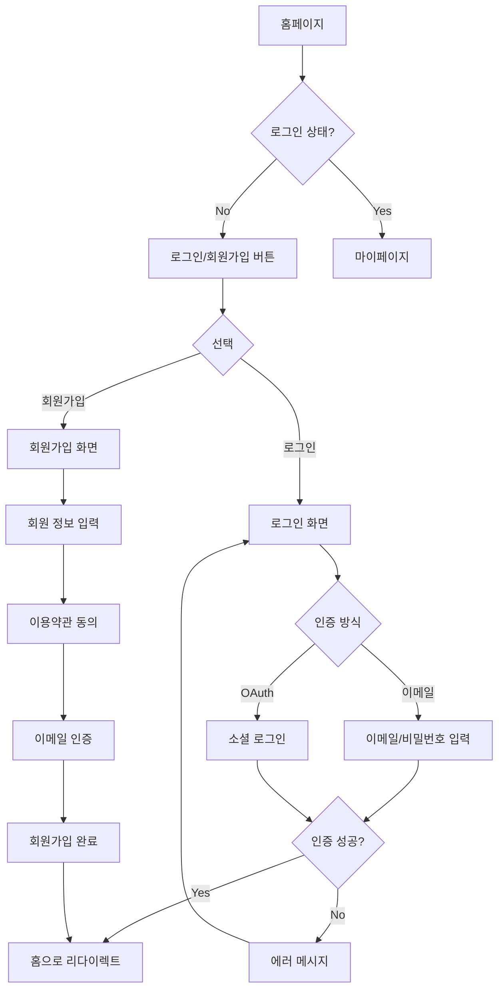
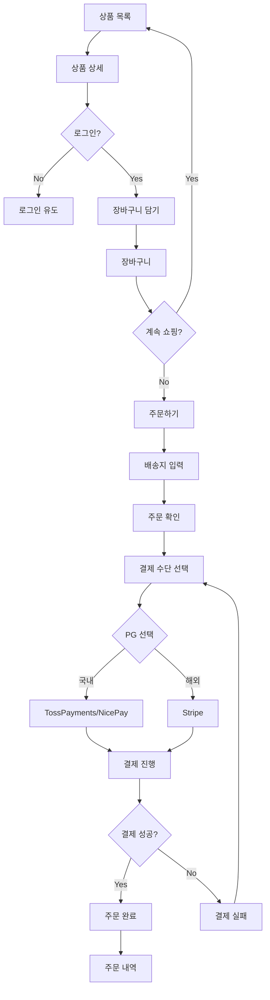
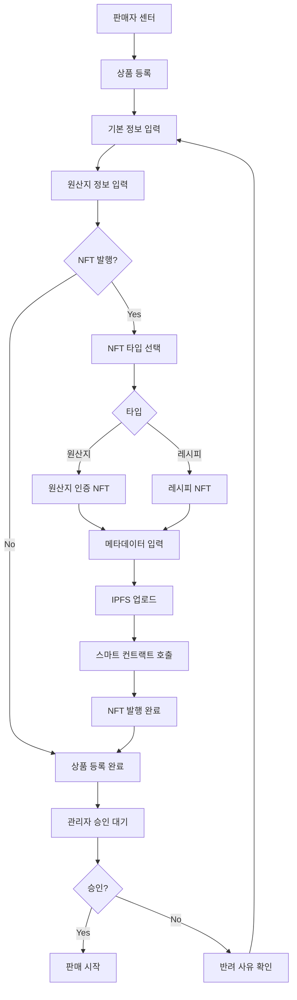

# Information Architecture (I.A) - XLCfi Platform

## 📌 문서 정보

**작성일:** 2025-11-21  
**버전:** 1.0.0  
**목적:** 프론트엔드 구현을 위한 정보 구조 설계  
**대상:** Web, Tablet, Mobile (반응형)

---

## 📋 목차

1. [I.A 개요](#ia-개요)
2. [사이트맵](#사이트맵)
3. [네비게이션 구조](#네비게이션-구조)
4. [사용자 여정 맵](#사용자-여정-맵)
5. [화면 흐름도](#화면-흐름도)
6. [콘텐츠 계층 구조](#콘텐츠-계층-구조)
7. [역할별 접근 권한](#역할별-접근-권한)

---

## I.A 개요

### 플랫폼 목적

K-Food 원료, 원산지, 음식, 요리방법, 레시피 등을 소개하고 거래할 수 있는 플랫폼

### 주요 사용자 그룹

1. **일반 방문자** - 정보 탐색, 회원가입
2. **구매자 (BUYER)** - 상품 구매, 리뷰 작성
3. **판매자 (SELLER)** - 상품 등록/관리, NFT 발행
4. **관리자 (ADMIN)** - 전체 시스템 관리

### 핵심 기능 영역

- 🔐 **인증/인가** - 회원가입, 로그인, 프로필 관리
- 🛍️ **상품** - 조회, 검색, 상세, 원산지 추적
- 🛒 **주문/결제** - 장바구니, 주문, 멀티 PG 결제
- ⭐ **리뷰/평가** - 리뷰 작성, 시각적 반응, 지수 표시
- 🔗 **블록체인** - NFT 조회, P2P 거래, 토큰 관리
- 📊 **대시보드** - 판매자/관리자 통계 및 관리

---

## 사이트맵

### Level 1: 전체 구조

```
XLCfi Platform (SpicyJump)
│
├─ 🏠 홈 (/)
│
├─ 🔐 인증
│  ├─ 로그인 (/login)
│  ├─ 회원가입 (/register)
│  ├─ 비밀번호 찾기 (/forgot-password)
│  └─ 비밀번호 재설정 (/reset-password)
│
├─ 🛍️ 상품
│  ├─ 상품 목록 (/products)
│  │  ├─ 카테고리별 (/products?category=:id)
│  │  ├─ 검색 결과 (/products?search=:keyword)
│  │  └─ 필터링 (/products?filter=...)
│  │
│  └─ 상품 상세 (/products/:id)
│     ├─ 기본 정보
│     ├─ 원산지 인증 (NFT)
│     ├─ 리뷰 & 평가
│     └─ 판매자 정보
│
├─ 🛒 주문/결제
│  ├─ 장바구니 (/cart)
│  ├─ 주문하기 (/checkout)
│  ├─ 결제 선택 (/payment)
│  ├─ 결제 완료 (/payment/success)
│  └─ 결제 실패 (/payment/fail)
│
├─ 👤 마이페이지 (/mypage)
│  ├─ 프로필 (/mypage/profile)
│  ├─ 주문 내역 (/mypage/orders)
│  │  └─ 주문 상세 (/mypage/orders/:id)
│  ├─ 리뷰 관리 (/mypage/reviews)
│  ├─ NFT 컬렉션 (/mypage/nfts)
│  │  ├─ 원산지 인증 NFT
│  │  ├─ 레시피 NFT
│  │  └─ 멤버십 NFT
│  ├─ 토큰 지갑 (/mypage/wallet)
│  │  ├─ XLCfi 토큰 잔액
│  │  ├─ 거래 내역
│  │  └─ 현금화 신청
│  └─ 설정 (/mypage/settings)
│
├─ 🏪 판매자 센터 (/seller) [SELLER]
│  ├─ 대시보드 (/seller/dashboard)
│  │  ├─ 판매 통계
│  │  ├─ 주문 현황
│  │  └─ 수익 분석
│  │
│  ├─ 상품 관리 (/seller/products)
│  │  ├─ 상품 목록
│  │  ├─ 상품 등록 (/seller/products/new)
│  │  └─ 상품 수정 (/seller/products/:id/edit)
│  │
│  ├─ 주문 관리 (/seller/orders)
│  │  ├─ 주문 목록
│  │  └─ 주문 상세 (/seller/orders/:id)
│  │
│  ├─ NFT 관리 (/seller/nfts)
│  │  ├─ 원산지 NFT 발행
│  │  └─ 레시피 NFT 발행
│  │
│  └─ 정산 관리 (/seller/settlements)
│     ├─ 정산 내역
│     └─ 토큰 수익
│
├─ 🔗 블록체인 (/blockchain)
│  ├─ NFT 마켓플레이스 (/blockchain/marketplace)
│  │  ├─ 원산지 NFT
│  │  ├─ 레시피 NFT
│  │  └─ 멤버십 NFT
│  │
│  ├─ P2P 거래 (/blockchain/p2p)
│  │  ├─ 거래 생성
│  │  ├─ 거래 목록
│  │  └─ 거래 상세
│  │
│  └─ 토큰 정보 (/blockchain/token)
│     ├─ XLCfi 토큰 소개
│     ├─ 토큰 이코노미
│     └─ 획득 방법
│
├─ 📊 커뮤니티
│  ├─ 레시피 게시판 (/community/recipes)
│  │  ├─ 레시피 목록
│  │  ├─ 레시피 상세
│  │  └─ 레시피 작성
│  │
│  ├─ 평가 & 반응 (/community/reviews)
│  │  ├─ 시각적 반응 대시보드
│  │  │  ├─ 맛/향/식감 반응 통계
│  │  │  └─ 감정 반응 통계
│  │  └─ 인기 리뷰
│  │
│  └─ 지수 랭킹 (/community/rankings)
│     ├─ 판매 가능성 TOP
│     ├─ 소비 가능성 TOP
│     ├─ 소비자 연결 TOP
│     └─ 수익 창출 효과 TOP
│
├─ 🔍 검색 & 필터
│  ├─ 통합 검색 (/search)
│  ├─ 고급 검색 (/search/advanced)
│  │  ├─ 상세 필터 (원산지, 등급, 가격 등)
│  │  └─ 지수 기반 필터
│  └─ GIS 기반 검색 (/search/nearby)
│     ├─ 내 주변 마켓
│     └─ 생산지 지도 보기
│
├─ ℹ️ 정보
│  ├─ 서비스 소개 (/about)
│  ├─ 이용 가이드 (/guide)
│  │  ├─ 구매자 가이드
│  │  ├─ 판매자 가이드
│  │  └─ NFT 가이드
│  ├─ FAQ (/faq)
│  └─ 고객센터 (/support)
│
└─ 🛡️ 관리자 (/admin) [ADMIN]
   ├─ 대시보드 (/admin/dashboard)
   ├─ 회원 관리 (/admin/users)
   ├─ 상품 관리 (/admin/products)
   ├─ 주문 관리 (/admin/orders)
   ├─ 결제 관리 (/admin/payments)
   ├─ 리뷰 관리 (/admin/reviews)
   ├─ NFT 관리 (/admin/nfts)
   ├─ 라벨링 관리 (/admin/labels)
   ├─ 지수 관리 (/admin/indices)
   └─ 시스템 설정 (/admin/settings)
```

---

## 네비게이션 구조

### Global Navigation (모든 페이지)

```
┌─────────────────────────────────────────────────────────────────┐
│  Logo  |  카테고리  |  검색  |  🔔  |  🛒  |  👤  |  🌐 KO ▼  │
└─────────────────────────────────────────────────────────────────┘
```

#### 1. 상단 네비게이션 (Header)

**좌측:**

- **Logo** - 홈으로 이동
- **카테고리 메뉴** - 드롭다운
  - 채소류
  - 과일류
  - 수산물
  - 육류
  - 가공식품
  - 레시피

**중앙:**

- **검색바**
  - 통합 검색
  - 자동완성
  - 최근 검색어

**우측:**

- **알림** 🔔 (로그인 시)
  - 주문 상태 알림
  - 리뷰 알림
  - 토큰 획득 알림

- **장바구니** 🛒 (로그인 시)
  - 장바구니 아이템 수
  - 미니 장바구니 미리보기

- **사용자 메뉴** 👤
  - 비로그인: 로그인/회원가입
  - 로그인: 프로필 드롭다운
    - 마이페이지
    - 주문 내역
    - NFT 컬렉션
    - 토큰 지갑
    - 로그아웃

- **언어 선택** 🌐
  - KO (한국어)
  - EN (English)
  - JA (日本語)
  - ZH (中文)

#### 2. 하단 네비게이션 (Footer)

**1열:**

- 회사 소개
- 이용약관
- 개인정보처리방침
- 사업자 정보

**2열:**

- 고객센터
- FAQ
- 공지사항
- 파트너 문의

**3열:**

- SNS 링크 (Instagram, Facebook, Twitter)
- 앱 다운로드 (iOS, Android)

**4열:**

- 저작권 정보
- 사업자 등록번호
- 통신판매업 신고번호

#### 3. 모바일 네비게이션

**햄버거 메뉴 (☰):**

```
┌─────────────────────┐
│ ☰ Menu              │
├─────────────────────┤
│ 🏠 홈               │
│ 🛍️ 상품             │
│ 🔗 NFT 마켓플레이스 │
│ 📊 커뮤니티         │
│ 👤 마이페이지       │
│ 🏪 판매자 센터      │ (SELLER)
│ 🛡️ 관리자          │ (ADMIN)
├─────────────────────┤
│ ℹ️ 서비스 소개      │
│ 📖 이용 가이드      │
│ ❓ FAQ             │
│ 📞 고객센터         │
└─────────────────────┘
```

**하단 탭 바 (Bottom Tab Bar):**

```
┌──────┬──────┬──────┬──────┬──────┐
│ 🏠   │ 🛍️   │  🔍  │ 🛒   │ 👤   │
│ 홈   │ 상품 │ 검색 │ 장바구니│ MY  │
└──────┴──────┴──────┴──────┴──────┘
```

---

## 사용자 여정 맵

### Journey 1: 구매자 - 상품 구매

```
1. 홈페이지 방문
   ↓
2. 상품 검색/탐색
   ├─ 카테고리 선택
   ├─ 검색어 입력
   └─ 필터 적용
   ↓
3. 상품 상세 확인
   ├─ 상품 정보 확인
   ├─ 원산지 NFT 확인
   ├─ 리뷰 & 평가 확인
   └─ 판매 가능성 지수 확인
   ↓
4. 장바구니 담기
   ├─ 수량 선택
   └─ 옵션 선택
   ↓
5. 장바구니 확인
   ├─ 상품 목록 확인
   ├─ 수량 조정
   └─ 삭제
   ↓
6. 주문하기
   ├─ 배송지 입력
   ├─ 배송 메모
   └─ 주문 확인
   ↓
7. 결제
   ├─ 결제 수단 선택
   │  ├─ TossPayments (국내)
   │  ├─ NicePay (국내)
   │  └─ Stripe (해외)
   └─ 결제 진행
   ↓
8. 주문 완료
   ├─ 주문 번호 발급
   ├─ 토큰 적립 (1%)
   └─ 이메일 알림
   ↓
9. 상품 수령
   ↓
10. 리뷰 작성
    ├─ 평점 (1-5)
    ├─ 텍스트 리뷰
    ├─ 사진 첨부
    ├─ 시각적 반응 선택
    └─ 토큰 적립 (100 XLCfi)
```

### Journey 2: 판매자 - 상품 등록

```
1. 판매자 센터 접속
   ↓
2. 상품 등록 시작
   ↓
3. 기본 정보 입력
   ├─ 상품명 (다국어)
   ├─ 카테고리 선택
   ├─ 가격
   ├─ 재고
   └─ 상품 설명
   ↓
4. 원산지 정보 입력
   ├─ 원산지 국가/지역
   ├─ 식품 코드
   ├─ HACCP 인증
   └─ 인증 서류 업로드
   ↓
5. 이미지 업로드
   ├─ 대표 이미지
   └─ 추가 이미지 (최대 5개)
   ↓
6. NFT 발행 선택 (선택사항)
   ├─ 원산지 인증 NFT
   └─ 메타데이터 입력
   ↓
7. 상품 등록 완료
   ├─ 관리자 승인 대기
   └─ 토큰 적립 (상품당 10 XLCfi)
   ↓
8. 승인 후 판매 시작
```

### Journey 3: NFT 구매자 - NFT 거래

```
1. NFT 마켓플레이스 접속
   ↓
2. NFT 탐색
   ├─ 원산지 인증 NFT
   ├─ 레시피 NFT
   └─ 멤버십 NFT
   ↓
3. NFT 상세 확인
   ├─ 메타데이터 확인
   ├─ 소유권 이력 확인
   ├─ 가격 확인
   └─ 판매자 정보
   ↓
4. P2P 거래 시작
   ├─ 구매 의사 표시
   └─ XLCfi 토큰 준비
   ↓
5. Escrow 계약
   ├─ 토큰 예치
   └─ 조건 확인
   ↓
6. NFT 이전
   ├─ 스마트 컨트랙트 실행
   └─ 온체인 기록
   ↓
7. 거래 완료
   ├─ NFT 소유권 이전
   ├─ 토큰 정산
   └─ 플랫폼 수수료 (2.5%)
```

---

## 화면 흐름도

### Flow 1: 회원가입 & 로그인



### Flow 2: 상품 구매



### Flow 3: NFT 발행 (판매자)



---

## 콘텐츠 계층 구조

### Level 1: 홈페이지

```
홈페이지
├─ Hero Section
│  ├─ 메인 슬라이더 (3-5개)
│  ├─ 검색바
│  └─ 주요 카테고리 바로가기
│
├─ Featured Products (추천 상품)
│  ├─ 신상품
│  ├─ 베스트셀러
│  └─ 할인 상품
│
├─ NFT Showcase
│  ├─ 최신 발행 NFT
│  └─ 인기 NFT
│
├─ 지수 랭킹
│  ├─ 판매 가능성 TOP 5
│  ├─ 소비 가능성 TOP 5
│  └─ 소비자 연결 TOP 5
│
├─ 커뮤니티 하이라이트
│  ├─ 인기 레시피
│  └─ 최신 리뷰
│
└─ 서비스 소개
   ├─ K-Food 플랫폼 소개
   ├─ NFT 시스템 소개
   └─ 토큰 이코노미 소개
```

### Level 2: 상품 상세

```
상품 상세 페이지
├─ 상품 이미지 갤러리
│  ├─ 메인 이미지
│  ├─ 썸네일 (최대 5개)
│  └─ 확대 보기
│
├─ 기본 정보
│  ├─ 상품명 (다국어)
│  ├─ 가격
│  ├─ 평점 & 리뷰 수
│  ├─ 재고 상태
│  └─ 배송 정보
│
├─ 원산지 정보
│  ├─ 원산지 국가/지역
│  ├─ 식품 코드
│  ├─ HACCP 인증
│  └─ 원산지 NFT (있는 경우)
│
├─ 지수 표시 (Advanced Evaluation)
│  ├─ 판매 가능성 (0-100%)
│  │  └─ 시장성 분석 그래프
│  ├─ 소비 가능성 (0-100%)
│  │  └─ 타겟층 분석
│  ├─ 수익 창출 효과
│  │  └─ 예상 수익률
│  └─ 소비자 연결 (0-100%)
│     └─ GIS 기반 도달률
│
├─ 판매자 정보
│  ├─ 판매자명
│  ├─ 평점
│  ├─ 라벨 (전문성)
│  └─ 판매자 페이지 링크
│
├─ 상품 설명 (탭)
│  ├─ 상세 설명
│  ├─ 영양 정보
│  ├─ 보관 방법
│  └─ 조리 방법
│
├─ 리뷰 & 평가
│  ├─ 평점 분포
│  ├─ 시각적 반응 통계 (Visual Reactions)
│  │  ├─ 맛 (Sweet, Salty, Spicy, etc.)
│  │  ├─ 식감 (Crispy, Soft, Chewy, etc.)
│  │  └─ 감정 (Satisfied, Surprised, etc.)
│  ├─ 리뷰 목록
│  │  ├─ 최신순
│  │  ├─ 평점순
│  │  └─ 도움순
│  └─ 리뷰 작성 버튼
│
└─ 구매 액션
   ├─ 수량 선택
   ├─ 장바구니 담기
   ├─ 바로 구매
   └─ 찜하기
```

### Level 3: 마이페이지

```
마이페이지
├─ 프로필 요약
│  ├─ 프로필 이미지
│  ├─ 이름
│  ├─ 이메일
│  ├─ 역할 (BUYER/SELLER)
│  └─ 라벨 (활동 등급)
│
├─ 대시보드
│  ├─ 주문 현황 (진행 중)
│  ├─ 토큰 잔액
│  ├─ NFT 보유 수
│  └─ 리뷰 작성 가능 (N개)
│
├─ 주문 내역
│  ├─ 필터 (전체/진행중/완료/취소)
│  ├─ 주문 목록
│  │  ├─ 주문 번호
│  │  ├─ 주문 날짜
│  │  ├─ 상품 정보
│  │  ├─ 금액
│  │  ├─ 상태
│  │  └─ 액션 (상세/리뷰작성/취소)
│  └─ 페이지네이션
│
├─ 리뷰 관리
│  ├─ 작성한 리뷰 목록
│  ├─ 작성 가능한 리뷰
│  └─ 받은 반응 통계
│
├─ NFT 컬렉션
│  ├─ 보유 NFT 목록
│  │  ├─ 원산지 인증 NFT
│  │  ├─ 레시피 NFT
│  │  └─ 멤버십 NFT
│  ├─ NFT 상세 보기
│  └─ P2P 거래 등록
│
├─ 토큰 지갑
│  ├─ XLCfi 잔액
│  ├─ 획득 내역
│  │  ├─ 상품 판매 (1%)
│  │  ├─ 리뷰 작성 (100 XLCfi)
│  │  └─ 추천인 보상 (0.5%)
│  ├─ 사용 내역
│  └─ 현금화 신청
│
└─ 설정
   ├─ 프로필 수정
   ├─ 비밀번호 변경
   ├─ 알림 설정
   ├─ 언어 설정
   └─ 회원 탈퇴
```

---

## 역할별 접근 권한

### 권한 매트릭스

| 화면/기능 | 비로그인 | BUYER | SELLER | ADMIN |
|-----------|----------|-------|--------|-------|
| **공통** |
| 홈 | ✓ | ✓ | ✓ | ✓ |
| 상품 목록 | ✓ | ✓ | ✓ | ✓ |
| 상품 상세 | ✓ | ✓ | ✓ | ✓ |
| 검색 | ✓ | ✓ | ✓ | ✓ |
| NFT 마켓플레이스 | ✓ | ✓ | ✓ | ✓ |
| **인증** |
| 로그인 | ✓ | - | - | - |
| 회원가입 | ✓ | - | - | - |
| **구매** |
| 장바구니 | - | ✓ | ✗ | ✓ |
| 주문하기 | - | ✓ | ✗ | ✓ |
| 결제 | - | ✓ | ✗ | ✓ |
| 주문 내역 | - | ✓ (본인) | ✗ | ✓ (전체) |
| **리뷰** |
| 리뷰 조회 | ✓ | ✓ | ✓ | ✓ |
| 리뷰 작성 | - | ✓ | ✗ | ✗ |
| 리뷰 수정/삭제 | - | ✓ (본인) | ✗ | ✓ (전체) |
| 시각적 반응 | - | ✓ | ✓ | ✓ |
| **판매** |
| 판매자 센터 | - | ✗ | ✓ | ✓ |
| 상품 등록 | - | ✗ | ✓ | ✓ |
| 상품 수정/삭제 | - | ✗ | ✓ (본인) | ✓ (전체) |
| 주문 관리 | - | ✗ | ✓ (본인 상품) | ✓ (전체) |
| 정산 관리 | - | ✗ | ✓ (본인) | ✓ (전체) |
| **NFT** |
| NFT 조회 | ✓ | ✓ | ✓ | ✓ |
| NFT 발행 | - | ✗ | ✓ | ✓ |
| P2P 거래 | - | ✓ | ✓ | ✓ |
| **토큰** |
| 토큰 지갑 | - | ✓ | ✓ | ✓ |
| 토큰 획득 | - | ✓ | ✓ | ✓ |
| 현금화 신청 | - | ✓ | ✓ | ✓ |
| **관리자** |
| 관리자 대시보드 | - | ✗ | ✗ | ✓ |
| 회원 관리 | - | ✗ | ✗ | ✓ |
| 상품 승인 | - | ✗ | ✗ | ✓ |
| 주문 관리 | - | ✗ | ✗ | ✓ |
| 리뷰 관리 | - | ✗ | ✗ | ✓ |
| 라벨링 관리 | - | ✗ | ✗ | ✓ |
| 지수 관리 | - | ✗ | ✗ | ✓ |
| 시스템 설정 | - | ✗ | ✗ | ✓ |

**범례:**

- ✓ : 접근 가능
- ✗ : 접근 불가
- - : 해당 없음
- (본인) : 본인 데이터만 접근
- (전체) : 모든 데이터 접근

---

## 다음 단계

이 I.A 문서를 기반으로 다음 작업을 진행합니다:

1. ✅ **I.A 완료** - 정보 구조 설계
2. ⏭️ **와이어프레임** - 화면별 레이아웃 설계
3. ⏭️ **프로토타입** - 인터랙션 설계
4. ⏭️ **UI 디자인** - 비주얼 디자인
5. ⏭️ **프론트엔드 구현** - 개발 시작

---

## 참고 문서

### 백엔드 설계 문서

- [Database Design](../../004.architecture/01_database_design.md)
- [Function Specs](../../004.architecture/06_function_specs.md)
- [User Interface Design](../../004.architecture/07_user_interface_design.md)
- [Backend Implementation Milestone](../../backend/BACKEND_IMPLEMENTATION_MILESTONE.md)

### 프론트엔드 설계 문서

- [Frontend Responsive Design](./01_frontend_responsive_design.md) (기존)

---

**문서 버전:** 1.0.0  
**최종 업데이트:** 2025-11-21  
**작성자:** 장재훈  **상태:** ✅ 초안 완료


